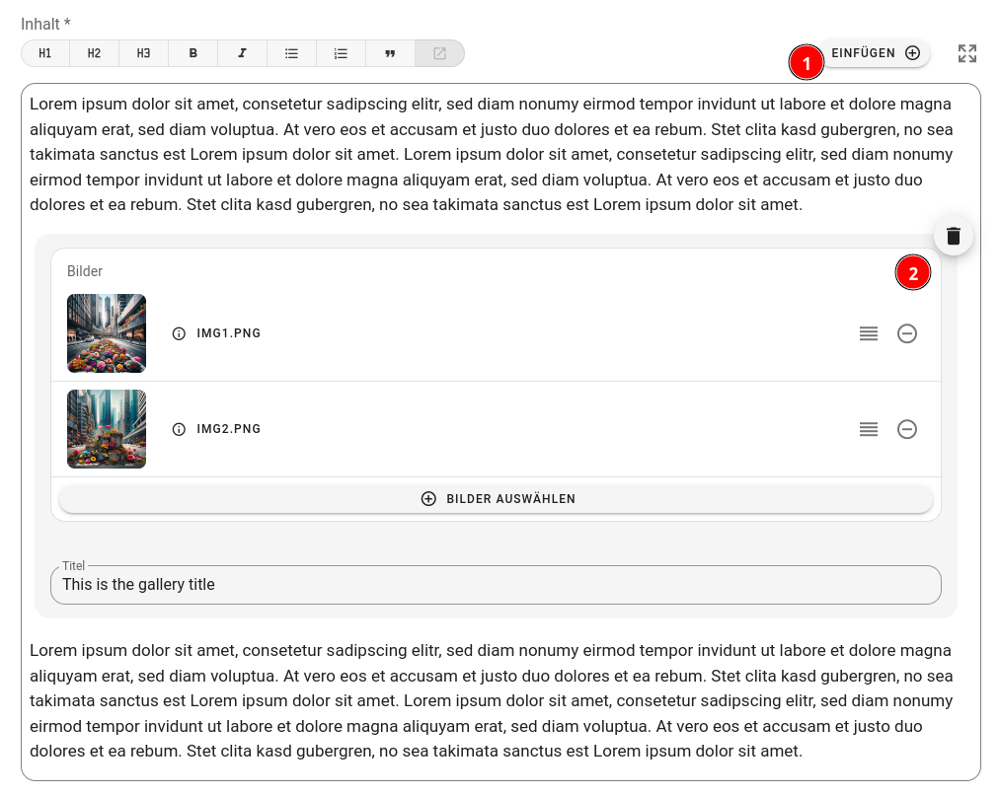

# WYSIWYG / Rich-Text-Editor

Flyo integriert einen fortschrittlichen WYSIWYG-Editor, der es Benutzern ermöglicht, Texte zu formatieren und benutzerdefinierte Elemente zu erstellen. Dieser Editor basiert auf der Technologie von [ProseMirror](https://prosemirror.net/). Ein Hauptvorteil des Flyo WYSIWYG-Editors ist seine flexible Integration, sowohl in einfacher als auch in komplexer Form. Nutzer können entweder den direkt nutzbaren HTML-Code-Output verwenden oder für eine tiefere Integration in Projekte die [JSON-Ausgabe](https://prosemirror.net/docs/ref/#model.Node) heranziehen. Dadurch lässt sich der Inhalt präzise an die spezifischen Anforderungen eines Projekts anpassen.

## Benutzerdefinierte Elemente

Ein benutzerdefiniertes Element ist ein vom Benutzer selbst erstelltes Element. Es wird über den "Einfügen"-Knopf in der Toolbar eingefügt. Der Benutzer kann die Eigenschaften des Elements definieren und die Darstellung seines Inhalts im HTML-Code steuern.

Das folgende Bild illustriert den Prozess der Erstellung eines benutzerdefinierten Elements:


1. Als Eigenschaften des Elements gelten HTML-Attribute, die verschiedene Typen wie Text, mehrzeiligen Text, Bild, Bilder, Datum, Farbe, Checkbox, Radio, Select und weitere umfassen können.
2. Der Name des Elements ist für die Verwendung im JSON-Code essentiell. Er muss einzigartig sein und darf keine Leerzeichen beinhalten.
3. Für die Definition der HTML-Ausgabe wird das Template-System [Latte](https://latte.nette.org/) verwendet. Hierbei können alle Attribute als Variablen genutzt werden. Die so erstellte HTML-Ausgabe ersetzt dann das Element im HTML-Code. Dies ermöglicht die Verwendung komplexer benutzerdefinierter Elemente selbst in Ausgabekanälen mit einfacher HTML-Struktur. [Mehr zum Template-System](#html-ausgabe-template)

Das oben definierte Element wird im Editor folgendermaßen dargestellt:



1. Das Element wird durch Klicken auf den "Einfügen"-Knopf hinzugefügt.
2. Die festgelegten Eigenschaften werden angezeigt und können vom Benutzer bearbeitet werden.
 
::: details Die JSON und HTML Ausgabe in einer Integration sieht dann wie folgt aus:
JSON:
```json
{
  "type": "doc",
  "content": [
    {
      "type": "paragraph",
      "content": [
        {
          "type": "text",
          "text": "Lorem ipsum dolor sit amet, consetetur sadipscing elitr, sed diam nonumy eirmod tempor invidunt ut labore et dolore magna aliquyam erat, sed diam voluptua. At vero eos et accusam et justo duo dolores et ea rebum. "
        }
      ]
    },
    {
      "type": "Images",
      "attrs": {
        "images": [
          {
            "source": "https://storage.flyo.cloud/img1_0ae75102.png",
            "caption": null,
            "copyright": null,
            "name": "img1.png"
          },
          {
            "source": "https://storage.flyo.cloud/img2_98928571.png",
            "caption": null,
            "copyright": null,
            "name": "img2.png"
          }
        ],
        "title": "This is the gallery title"
      }
    },
    {
      "type": "paragraph",
      "content": [
        {
          "type": "text",
          "text": "Stet clita kasd gubergren, no sea takimata sanctus est Lorem ipsum dolor sit amet. Lorem ipsum dolor sit amet, consetetur sadipscing elitr, sed diam nonumy eirmod tempor invidunt ut labore et dolore magna aliquyam erat, sed diam voluptua. At vero eos et accusam et justo duo dolores et ea rebum. Stet clita kasd gubergren, no sea takimata sanctus est Lorem ipsum dolor sit amet"
        }
      ]
    }
  ]
}
```
Html:
```html
<p>Lorem ipsum dolor sit amet, consetetur sadipscing elitr, sed diam nonumy eirmod tempor invidunt ut labore et dolore magna aliquyam erat, sed diam voluptua. At vero eos et accusam et justo duo dolores et ea rebum. </p>
<div>
    <h3>This is the gallery title</h3>
    
    
</div>
<p>Stet clita kasd gubergren, no sea takimata sanctus est Lorem ipsum dolor sit amet. Lorem ipsum dolor sit amet, consetetur sadipscing elitr, sed diam nonumy eirmod tempor invidunt ut labore et dolore magna aliquyam erat, sed diam voluptua. At vero eos et accusam et justo duo dolores et ea rebum. Stet clita kasd gubergren, no sea takimata sanctus est Lorem ipsum dolor sit amet</p>
```
:::

## Rekursive Inhalteingabe

Falls die Notwendigkeit besteht, den WYSIWYG-Editor dynamisch weiterhin innerhalb des Content-Elements zu nutzen, kann diese Option aktiviert werden. Dadurch kann der Benutzer die Funktionalität und Bequemlichkeit des Editors innerhalb des Elements weiterhin nutzen und sogar zusätzliche benutzerdefinierte Elemente einfügen oder verschachteln.


1. Die Option für die rekursive Inhalteingabe wird aktiviert.
2. In der HTML-Ausgabe steht nun die vordefinierte Variable `{$content}` zur Verfügung, die den Inhalt des Elements enthält.


1. Das Content-Element wird nun im Editor angezeigt und kann bearbeitet werden. Durch die aktivierte Option `Rekursive Inhalteingabe` kann der Benutzer weiterhin Inhalte eingeben, wie er es gewohnt ist, einschließlich Formatierungen. Es ist sogar möglich, weitere benutzerdefinierte Elemente einzufügen, also eine Verschachtelung vorzunehmen.
2. Ein weiteres benutzerdefiniertes Element wurde als Rekursion eingefügt.

::: details Die JSON und HTML Ausgabe in einer Integration sieht dann wie folgt aus:
JSON:
```json
{
  "type": "doc",
  "content": [
    {
      "type": "paragraph",
      "content": [
        {
          "type": "text",
          "text": "Lorem ipsum dolor sit amet, consetetur sadipscing elitr, sed diam nonumy eirmod tempor invidunt ut labore et dolore magna aliquyam erat, sed diam voluptua. At vero eos et accusam et justo duo dolores et ea rebum. "
        }
      ]
    },
    {
      "type": "InfoBox",
      "attrs": {
        "author": "Flyo System"
      },
      "content": [
        {
          "type": "paragraph",
          "content": [
            {
              "type": "text",
              "text": "Hier ist es mglich auch WYSIWYG Funktionalität zu verwenden wie "
            },
            {
              "type": "text",
              "marks": [
                {
                  "type": "bold"
                }
              ],
              "text": "Fett"
            },
            {
              "type": "text",
              "text": " oder "
            },
            {
              "type": "text",
              "marks": [
                {
                  "type": "italic"
                }
              ],
              "text": "Kursiv"
            },
            {
              "type": "text",
              "text": ", oder sogar andere Custom Element:"
            }
          ]
        },
        {
          "type": "Images",
          "attrs": {
            "images": [
              {
                "source": "https://storage.flyo.cloud/img1_0ae75102.png",
                "caption": null,
                "copyright": null,
                "name": "img1.png"
              }
            ],
            "title": "Gallery Custom Element"
          }
        }
      ]
    },
    {
      "type": "paragraph",
      "content": [
        {
          "type": "text",
          "text": "Stet clita kasd gubergren, no sea takimata sanctus est Lorem ipsum dolor sit amet. Lorem ipsum dolor sit amet, consetetur sadipscing elitr, sed diam nonumy eirmod tempor invidunt ut labore et dolore magna aliquyam erat, sed diam voluptua. At vero eos et accusam et justo duo dolores et ea rebum. Stet clita kasd gubergren, no sea takimata sanctus est Lorem ipsum dolor sit amet"
        }
      ]
    }
  ]
}
```
HTML:
```html
<p>Lorem ipsum dolor sit amet, consetetur sadipscing elitr, sed diam nonumy eirmod tempor invidunt ut labore et dolore magna aliquyam erat, sed diam voluptua. At vero eos et accusam et justo duo dolores et ea rebum. </p>
  <div class=\"infobox\">
    <p>Hier ist es mglich auch WYSIWYG Funktionalität zu verwenden wie <strong>Fett</strong> oder <em>Kursiv</em>, oder sogar andere Custom Element: </p>
  <div>
    <h3>Gallery Custom Element</h3>
    
  </div>
  <p>Autor: Flyo System</p>
</div>
<p>Stet clita kasd gubergren, no sea takimata sanctus est Lorem ipsum dolor sit amet. Lorem ipsum dolor sit amet, consetetur sadipscing elitr, sed diam nonumy eirmod tempor invidunt ut labore et dolore magna aliquyam erat, sed diam voluptua. At vero eos et accusam et justo duo dolores et ea rebum. Stet clita kasd gubergren, no sea takimata sanctus est Lorem ipsum dolor sit amet</p>
```
:::

## HTML-Ausgabe Template

Variablen können mit `{$name}` angesprochen werden. Erfahre mehr über die [generelle Verwendung der Template-Engine](template.md).

Bei der Arbeit mit den Eigenschaftstypen `Bilder` oder `Dateien` ist die Verwendung einer `foreach`-Schleife erforderlich:

```html
<div>
  {foreach $images as $image}
    {if $image}
      
    {/if}
  {/foreach}
</div>
```