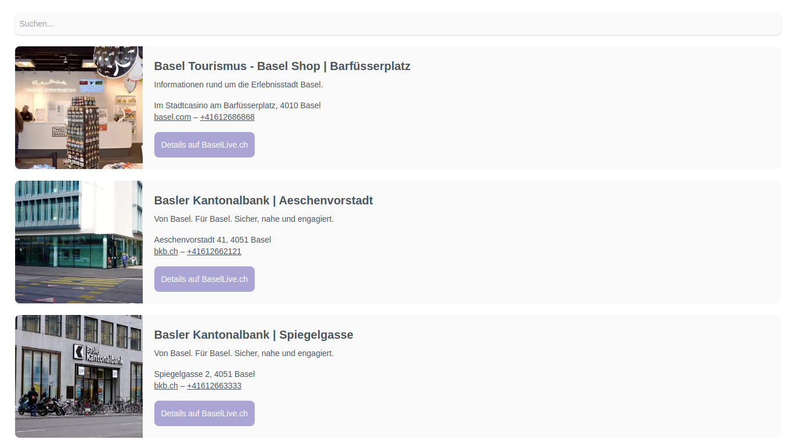

# Embed Integration

Ein Embed Code kann Inhalte aus Content Pools via HTML-Code ausgeben. Die Flyo Embed Codes basieren auf `Web Components`, welche mit allen [modernen Browsern](https://caniuse.com/custom-elementsv1) funktionieren.

Ein Beispiel für einen Embed Code könnte so aussehen:

```html
<script src="https://embed.flyo.cloud/embed.min.js"></script>
<embed-list id="XX" token="123123123123123123123123123123123"></embed-list>
```

## Layouts

Es gibt verschieden Layouts, die für einen Embed Code zur Verfügung stellen. Sie bieten unterschiedlich viel Platz für Informationen und setzen den Fokus entweder auf visuelle (z.B. Layout "Card") oder inhahltiche (z.B. Layout "Dense List") Elemente:

### Layout "List"



### Layout "Card"


## Embed Code einbetten

Wenn immer möglich, sollte der Script-Teil `<script src="https://embed.flyo.cloud/embed.min.js"></script>` in die `<head>` Section einer Webseite eingebunden werden, wobei der Script-Teil für den Inhalt am späteren Ausgabeort eingebunden wird:

```html
<html>
 <head>
  <title>Meine Webseite</title>
  <script src="https://embed.flyo.cloud/embed.min.js"></script>
 </head>
 <body>
  <p>Hier kommt mein Embed Code:</p>
  <embed-list id="XX" token="123123123123123123123123123123123"></embed-list>
 </body>
</html>
```

> Werden mehrere Embed Codes auf einer Seite eingebunden, sollte das `embed.min.js`-Script nur einmal eingebunden werden.

## Schriftart und Schriftgrösse

Embed Codes verwenden Schriftgrössen in der Einheit `em`. Sie verhalten sich somit relativ zum übergeordneten Element: 

```html
<div style="font-size:18px">
    <List id="80" token="Token" />
</div>
```

Die Angabe `18px` setzt nun die basis Schrift (100%) auf 18px innerhalb des Embed Codes um 20%. 

Die Schriftart wird anhand der im `<body>` oder `<html>` definierten `font-family` angewendet.

## Legacy

Embed Codes verwenden eine moderne Form von Javascript-Komponenten, welche von älteren Browsern nicht unterstützt werden. Dies gilt insbesondere für den Microsoft Internet Explorer 11 und älter. Wenn diese Versionen dennoch unterstützt werden sollen, muss zusätzlich das Script `<script src="https://unpkg.com/@webcomponents/webcomponentsjs@2.4.3/webcomponents-loader.js"></script>` eingebunden werden.