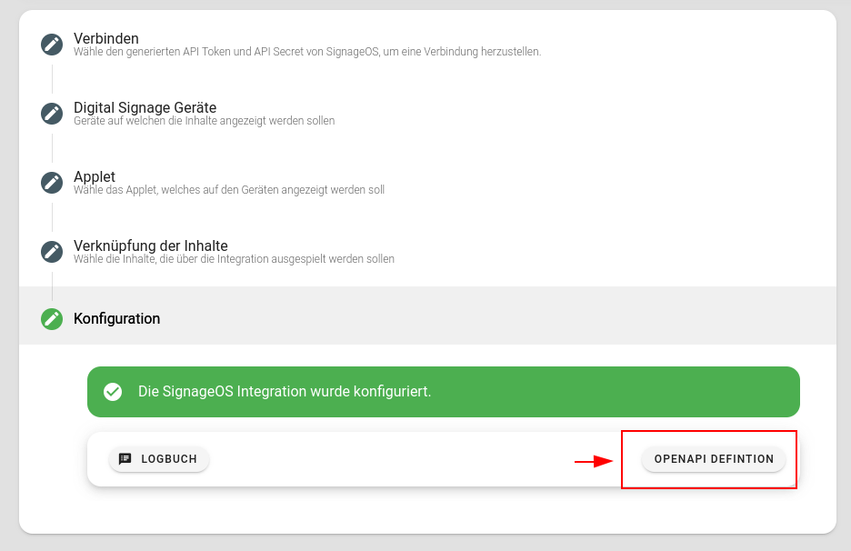
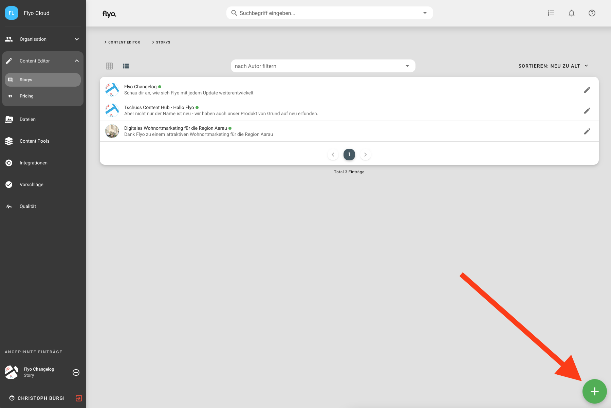
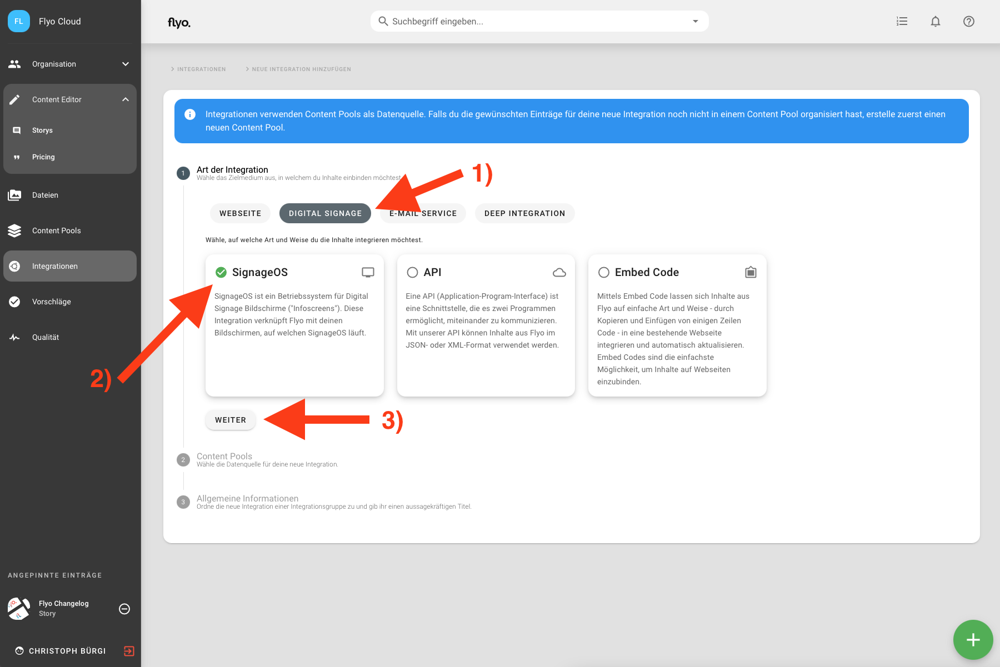
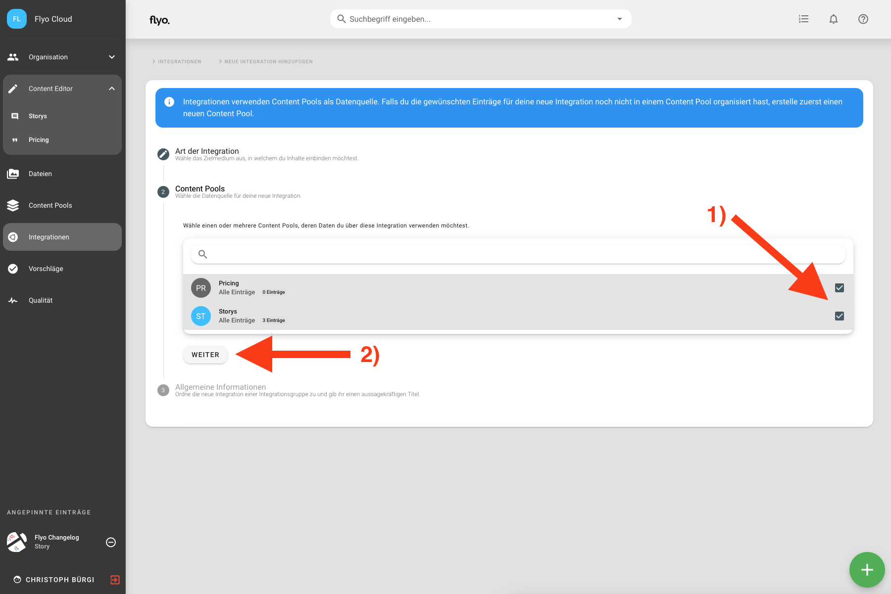
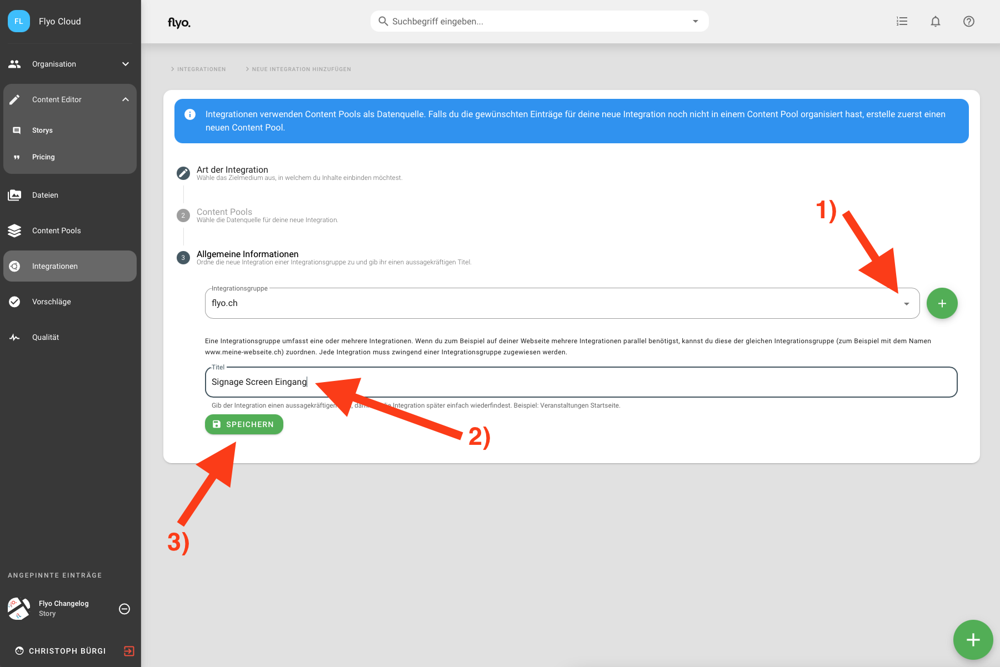
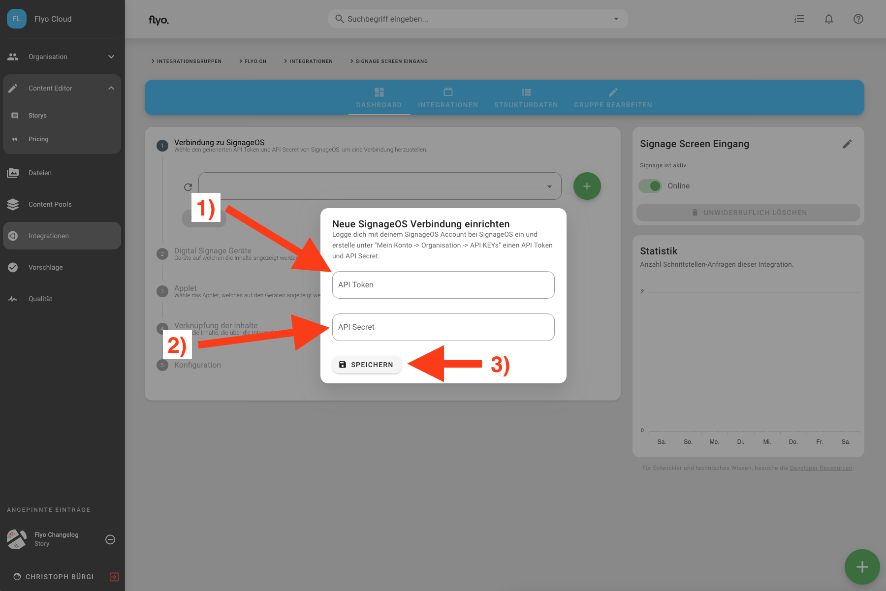
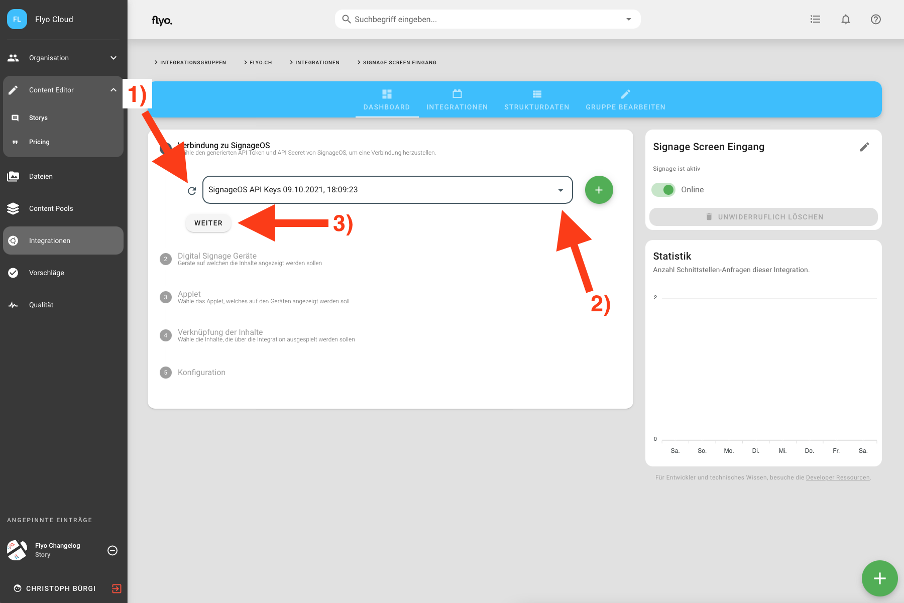
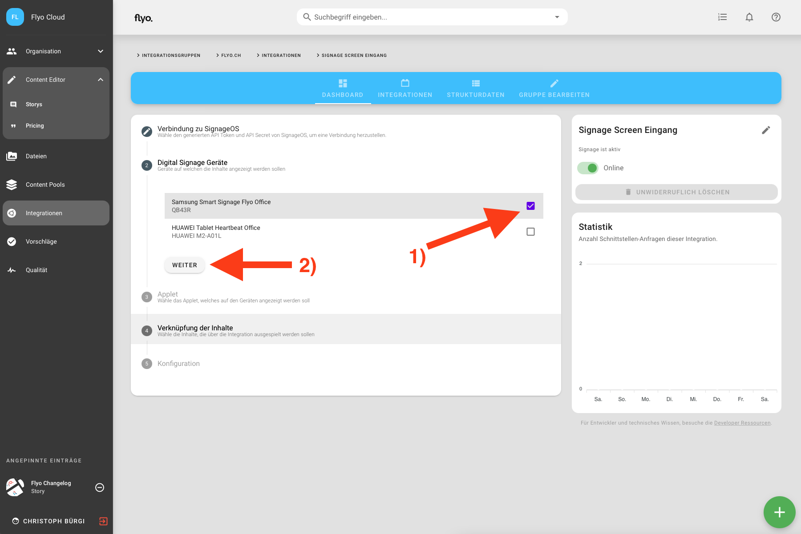
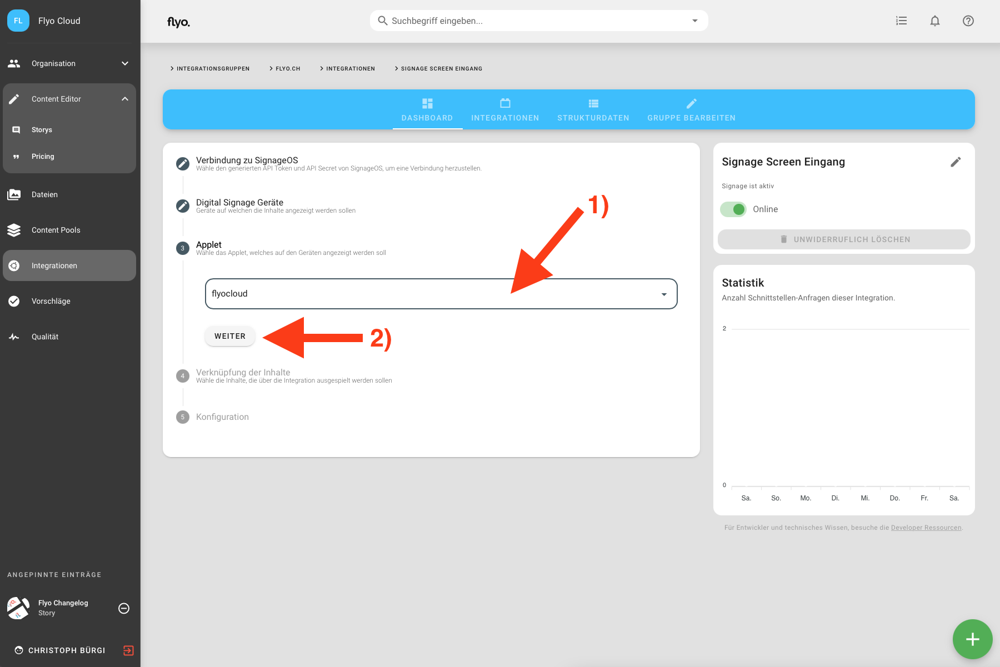
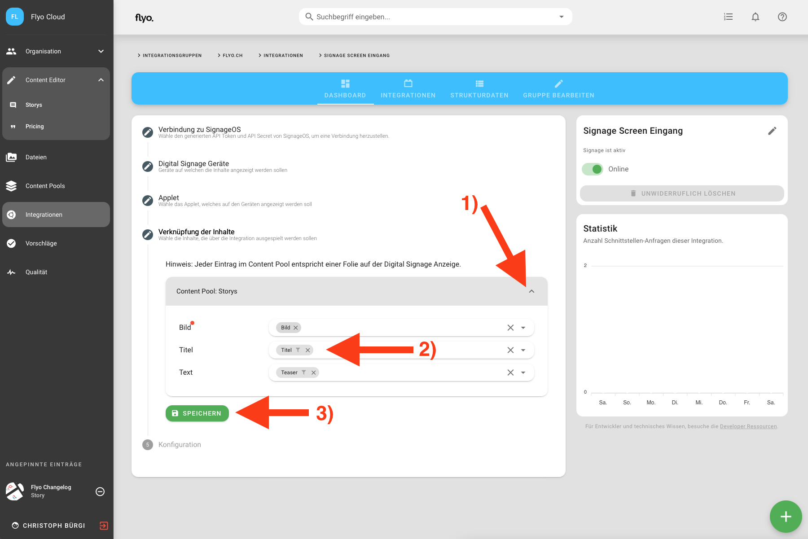

# SignageOS Integration

[SignageOS](https://www.signageos.io/) ist ein Player zur Anzeige von Inhalten auf Digital Sigange-Bildschirmen. Mittels Applets (Formatvorlagen) können Inhalte aus Flyo auf hunderten von Bildschirmen automatisiert nach deinen Regeln abgespielt werden..

::: tip Voraussetzungen
 Für die [SigangeOS](https://signageos.io) Integration in Flyo wird ein aktiver [SignageOS Box Account](https://box.signageos.io/) benötigt.

Um neue Geräte bei SignageOS hinzufügen zu können, muss im SignageOS Account eine "Company" und eine "Organization" erstellt und aktiv sein.

[API Token und Secret](https://box.signageos.io). Zu finden unter Settings - Company - Organizations - Organization wählen - API Tokens - Add new Token
:::

Wichtige Links:

+ [SignageOS Liste aller unterstützten Geräten](https://www.signageos.io/supported-devices/)
+ [Ein Gerät zu SigangeOS hinzufügen (provisionieren)](https://docs.signageos.io/provisioning)

## Applet Upload

::: warning Upload nur via CLI
Das Applet muss (Stand: August 2022) via CLI in die SignageOS-Plattform hochgeladen werden und setzt technisches Wissen voraus.
:::

Um ein Applet auf SignageOS hochzuladen, muss der Applet Code vorliegen. In diesem Beispiel verwenden wir das [Flyo Beispiel Applet](https://github.com/flyocloud/signageos-example).

1. Clone das Repository (oder dein eigenes) auf deinen Computer `git clone https://github.com/flyocloud/signageos-vue2-example.git` oder `https://github.com/flyocloud/signageos-js-example`
2. Führe im Ordner des Clones den Befehl `npm install` aus.
3. Installiere das globale SignageOS CLI Script mittels `npm install @signageos/cli -g`
4. Einloggen mittels Befehl `sos login` (Du musst über einen https://box.signageos.io/ Account verfügen)
5. Stelle die Standard-Organisation ein `sos organization set-default`
6. Lade das Applet mittels `npm run release` hoch. Das Ergebnis auf diesen Befehl sollte lauten: `Applet XYZ version 1.0.0 has been uploaded.`

## Applet Entwicklung

::: tip Beispiel Applet
Ein Beispiel-Applet findest du auf [GitHub.com](https://github.com/flyocloud/signageos-vue2-example).
:::

Für die Entwicklung eines Applets stellt Flyo eine OpenAPI-Datei zur Verfügung, welche alle Felder und Daten beschreibt, die via Flyo SignageOS-Schnittstelle angeliefert werden.

Dies Datei erklärt mit einem Beispiel, welche Daten für eine Applet-Entwicklung zur Verfügung stehen. Ein Übersicht findest du hier:

+ image: Bild
+ title: Titel
+ teaser: Teaser
+ uid: Eine Unique ID
+ metric: Die API für alfälliges Tracking mittels [Flyo Metrics System](../infos/metrics.md)
+ qrcode: Ein Base64 encoded QR Code der beim scannen eine [Metric Impression](../infos/metrics.md) auslöst.
+ entity_id: Die ID der Entität
+ entity_type: Der Typ, welcher zu dieser Entität gehört, z.B `file`, `event`, `poi`, `tag`
+ pool_id: Der Pool welcher verwendet wird.
+ item_identifier: Ein optionaler identifiert welcher im Flyo interface definiert werden kann um bestimmte Pools anders darzustellen im Applet

Unter [GitHub.com/flyocloud/signageos-example](https://github.com/flyocloud/signageos-example) gibt es ein Beispiel-Applet, das sich als guter Startpunkt für die Entwicklung des eigenen Applets eignet.

## Bildschirm Einrichten 

(Beispiel: Samsung Smart Signage Platform (SSSP) - Tizen)

::: details Unser Beispielgerät 
In diesem Beispiel haben wir einen [Samsung QB43R 43" Smart Signage Screen von Digitec](https://www.digitec.ch/de/s1/product/samsung-qb43r-43-3840-x-2160-pixels-digital-signage-11206798) verwendet und mit Flyo verbunden. Unterstützte SSSP Versionen sind [hier]( https://www.signageos.io/supported-devices/samsung-sssp-tizen) zu finden.
:::

Die Samsung Smart Signage Platform (SSSP) ist eine proprietäre All-in-One-Lösung, die in Samsung Smart Signage Geräten fest eingebaut ist und keine zusätzlichen Geräte benötigt, um mit Flyo zu kommunizieren und Inhalte abspielen zu können. Um ein Samsung Smart Signage Gerät mit Flyo zu verbinden, gehst du wie folgt vor:

**Schritt 1: Samsung Smart Signage Gerät konfigurieren**

1. Stromkabel - und falls gewünscht Netzwerkkabel (Patchkabel RJ45/RJ45) anschliessen, Batterien in die Fernbedieung einsetzen und Smart Sigange Screen einschalten.
2. Dem Installationsprozess von [Tizen Sigange OS](https://docs.signageos.io/provisioning/device-provisioning-tizen) Schritt für Schritt folgen. Sobald die SignageOS App erfolgreich installiert wurde, wird das Gerät neugestartet und auf dem Gerät ein Verifizierungs-Code angezeigt.

**Schritt 2: Gerät im SignageOS Box Account hinzufügen**

1. Im [SignageOS Box Account](https://box.signageos.io/) einloggen und den Navigationspunkt [Devices > Add Device](https://box.signageos.io/devices/new) aufrufen.
2. Verification Hash (wird auf dem Samsung Smart Signage Gerät angezeigt), ein Gerätename (in unserem Fall "Samsung Smart Signage Flyo Office") definieren und die gewünschte Organisation auswählen. Falls benötigt, ist [hier](https://docs.signageos.io/knowledge-base/how-to-provision-device-with-cloud) eine detaillierte Anleitung zu finden.
3. Mit dem nächsten Abschnitt fortfahren.

**Schritt 3: Flyo Integration hinzufügen**

1. [Flyo](https://flyo.cloud) öffnen, zum Hinzufügen-Menü wechseln und "Integration" wählen

2. Art der Integration: "Digital Signage" und anschliessend "SignageOS" wählen.

3. Content Pools: Einen oder mehrere Content Pools anwählen, für die Integration verwendet werden. Werden mehrere Content Pools markiert, werden die Inhalte nacheinander abgespielt.

4. Allgemeine Informationen: Integrationsgruppe wählen und Integration benennen. Falls keine Integrationsgruppe vorhanden ist, muss über das grüne Plus-Icon eine Integrationsgruppe erstellt werden. Auf Speichern klicken, um zur Konfiguration zu gelangen.

**Schritt 4: Flyo Integration konfigurieren**

1. Verbindung zu SignageOS: Auf das grüne Plus-Icon klicken und API Token und API Secret eingeben.

Anschliessend auf das Icon bei 1) klicken, um die soeben erstellte Verbinung zu laden. Entsprechende Verbindung auswählen.

2. Digital Signage Geräte: Geräte auswählen, die mit dieser Integration verwendet werden sollen. Ein Gerät kann gleichzeitig nur für eine Integration verwendet werden.

3. Applet: Applet wählen, welches für die Darstellung der Inhalte verwendet werden soll.

4. Verknüpfung der Inhalte: Das Applet definiert das Layout der Inhalte auf dem Screen. Das Mapping definiert die Verknüpfung der zur Verfügung stehenden Layout Positionen mit den Inhalten aus Flyo. Ist das Mapping korrekt erfolgt, wird die Integration konfiguriert und eine Bestätigung angezeigt.

