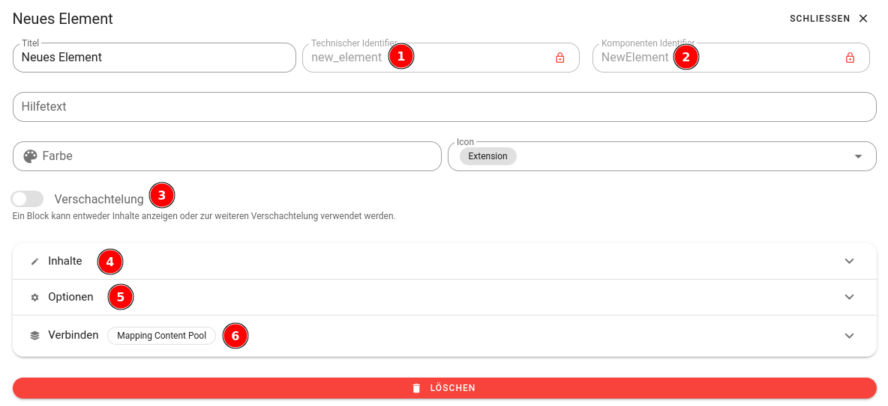

# Blocks

:::danger Im Aufbau
Dieser Abschnitt wird derzeit noch bearbeitet.
:::

Bei der Erstellung von Blöcken, ähnlich wie bei flyo, sollten bestimmte Schritte beachtet werden. Nachdem ein Block erstellt wurde, muss überlegt werden, wie dieser in der App verwendet wird. Welche Funktionen und Eigenschaften sollen in der App damit umgesetzt werden? Es ist wichtig, den Unterschied zwischen Content, Config und Items zu verstehen. Content bezieht sich auf den eigentlichen Inhalt, der im Block angezeigt wird, während Config die Konfigurationsoptionen für den Block definiert. Items können als individuelle Elemente oder Datenpunkte betrachtet werden, die im Block verwendet werden.

## Flyo Blocks umfasst die folgenden wesentlichen Konfigurationspunkte:

1. Der technische Identifier (Snake Case) kann genutzt werden, um den Block auf der Website/Applikation eindeutig zu identifizieren.
2. Der Komponenten-Identifier (Camel Case) ermöglicht ebenfalls die Identifikation des Blocks innerhalb der Webseite/Applikation. Der Komponenten-Identifier wird in der Regel in komponentenbasierten Systemen verwendet.
3. Bei Aktivierung der Verschachtelung können weitere Inhaltslemente innerhalb der benannten Position eingefügt werden. In der API werden diese Verschachtelungen als Slots bezeichnet, wobei jedem Slot eine feste Kennung zugewiesen wird.
4. Inhalte repräsentieren die klassischen Variablen, die für dieses Inhaltslement benötigt werden, wie zum Beispiel Text oder Titel. In der API wird dies als `content` bezeichnet.
5. Optionen werden häufig für optionale Darstellungsvarianten dieses Inhaltslements verwendet, wie zum Beispiel "Farbe" oder "Größe". In der API wird dies als `config` bezeichnet.
6. Die Items sind immer ein Array, das Daten aus einem Content-Pool iteriert. In der API werden diese als `items` bezeichnet.

(TODO)

- Verschachtelte Elemente
- Identifier/Komponente änderung