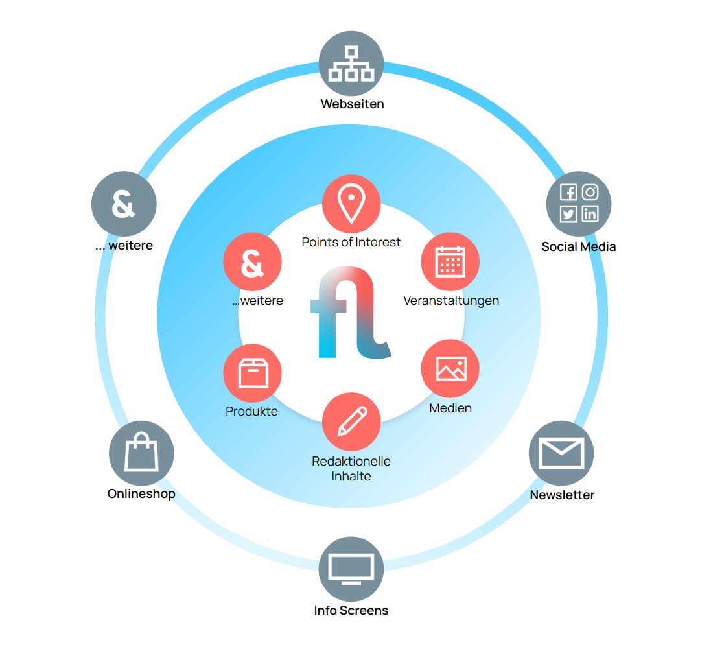

# Flyo Developer-Ressourcen

Die Flyo Developer-Ressourcen helfen beim Integrieren von Inhalten aus Flyo in die verschiedenen Output-Kanäle.

Folgenden Themen werden in den Developer-Ressourcen behandelt:

+ [Bilder](infos/images.md)
+ [Metriken](infos/metrics.md)
+ [Content Pools](infos/pools.md)
+ [Felder Mapping](infos/mapping.md)
+ [Rate Limit](infos/ratelimit.md)

Zur Verfügung stehende Integrationen:

+ [Webflow Integration](integrations/webflow.md)
+ [Embed Integration](integrations/embed.md)
+ [Map Integration](integrations/map.md)
+ [Hook Integration](integrations/hooks.md)
+ [API Integration](integrations/api.md)
+ [API SDK Integration](integrations/sdk.md)
+ [SignageOS Integration](integrations/signageos.md)
+ [Adobe Indesign Integration](integrations/indesign.md)
+ [Mailjet Integration](integrations/mailjet.md)
+ [Shopify Integration](integrations/shopify.md)
+ [Nitro Integration](nitro/)
+ [Webseite Baukasten](platforms/websitebuilder)

## Voraussetzung

+ Ein aktiver Flyo Account, der mit einer Organisation verbunden ist. 
+ Die Berechtigungen für den Bereich "Integrationen" in der entsprechenden Organisation.

## Glossar

+ `Entität/Entity`: Bezeichnet einen Inhaltstyp z.B `Blog`, `Veranstaltung`
+ `Content Pool`: Behälter, der kuratierte oder regelbasierte Inhalte einer Entität organisiert. Content Pools bilden die Grundlage für die Verteilung von Inhalten über Integrationen. Ein kuratierter Content Pool kann über mehrere Entitäten hinweg organisiert sein.
+ `Integration`: Der Ort an dem die Daten von Content Pools ausgespielt werden, z.B via API für eine Webseite oder ein Embed Code welcher auf einer Webseite eingebunden wird.
+ `Flyo Metric`: Anzahl Impressionen eines einzelnen Eintrags messen und in Flyo visualieren.

