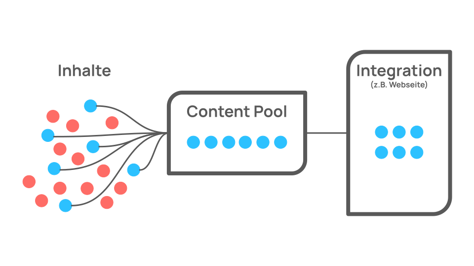
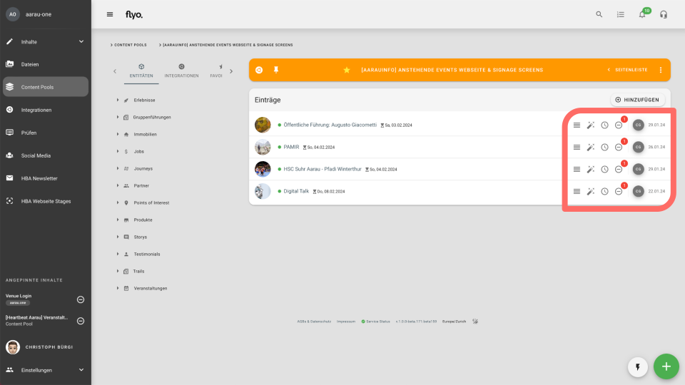
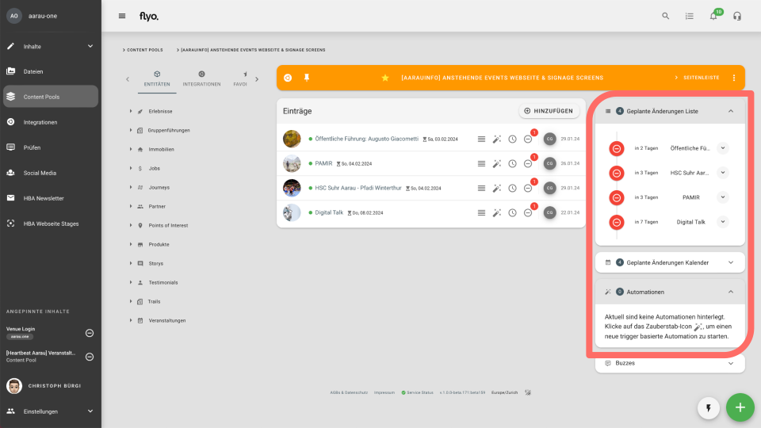
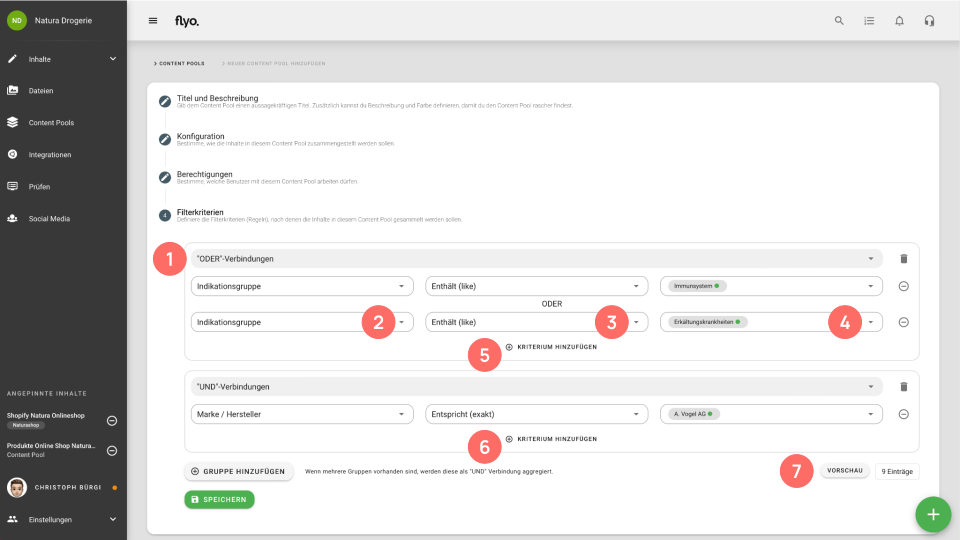

# Content Pools

Content Pools funktionieren wie Ordner für Dateien auf einem Computer und dienen dazu, Inhalte für unterschiedliche Anwendungszwecke zu organisieren und zu automatisieren. Es gibt zwei Typen von Content Pools in Flyo. Während bei kuratierten Content Pools die Elemente im Pool von Hand definiert werden, stellt Flyo bei regelbasierten Content Pools die Elemente automatisiert anhand von dir festgelegten Filterkriterien zusammen und aktualisiert diese in Real-Time.

::: info Berechtigungen im Kontext von Content Pools
Mit der Berechtigungslogik für Content Pools wird in erster Linie gesteuert, welche Teammitglieder mit welchen Inhalten in Flyo arbeiten dürfen. Die Berechtigungen können in den Einstellungen des Content Pools im Tab "Berechtigungen" gesteuert werden. --> [Mehr Informationen](/howto/manage-permissions)
:::

## Kuratierte Content Pools
In einem kuratierten Content Pool können die Inhalte frei bestimmt werden. Inhalte können von Hand oder nach einem Fahrplan oder Trigger Automationen hinzugefügt oder entfernt werden. Ebenso kann die Reihenfolge der Inhalte im Content Pool frei bestimmt werden.

**Eigenschaften:**
- **Mehrere Entitäten** --> Ein kuratierter Content Pool kann Inhalte einer oder mehrerer Entitäten beinhalten
- **Kuratierung** --> Die Reihenfolge der Einträge im Content Pool kann per Drag & Drop gesteuert werden
- **Fahrplan** --> Jeder Inhalt im Content Pool kann zeitgesteuert einem kuratierten Content Pool hinzugefügt oder daraus entfernt werden
- **Trigger** --> Die Sichtbarkeit von Inhalten in Integrationen kann zeit- und wetterbasiert gesteuert werden
- **Limit** --> Limitieren, wie viele Inhalte in einem Content Pool sein dürfen
- **Duplikate vermeiden** --> Verhindert, dass ein Inhalt mehrfach in einen Content Pool eingefügt wird

 

Erklärung der Icons (v.l.n.r):
- Reihenfolge der Inhalte anpassen (Drag & Drop)
- Automation erstellen
- Inhalt zeitbasiert aus dem Content Pool entfernen
- Inhalt sofort entfernen (Indikation zeigt, dass Inhalt bereits zeitbasiert entfernt wird)
- Das Datum zeigt an, wann der Eintrag in den Content Pool hinzugefügt wurde

Für jeden kuratierten Content Pool kann in der Seitenleiste ein Fahrplan (Liste / Kalender) mit den geplanten Änderungen angezeigt werden:

 

## Regelbasierte Content Pools
Mit einem regelbasierten Content Pool können Inhalte nach bestimmten Regeln zusammengefasst werden. Alle Inhalte, die den definierten Regeln des Content Pools entsprechen, werden in Real-Time in den Content Pool hinzugefügt oder entfernt.

**Eigenschaften:**
- **Einzelne Entität** --> Ein regelbasierter Content Pool kann Inhalte einer einzelnen Entität beinhalten
- **Filter** --> Als Filterkriterien können Felder angewendet werden, die für die entsprechende Entität konfiguriert wurden
- **Aktualisierung** --> Inhalte, die bearbeitet werden und neu bzw. nicht mehr den Kriterien des Content Pools entsprechen, werden in Real-Time in den Content Pool hinzugefügt oder daraus entfernt

### :one: --> Verbindungen der Filtergruppen
Definiert, wie die Filterkriterien zueinander in Relation stehen. Bei UND-Verbindungen müssen alle Kriterien additiv erfüllt sein, damit ein Inhalt im Content Pool berücksichtigt wird. Bei einer OR-Verbindung muss eines von x Kriterien erfüllt sein.

### :two: --> Attribut
Entspricht dem Filterkriterium. Als Auswahl stehen alle Felder zur Verfügung, die in der gewählten Entität definiert sind

### :three: --> Vektor
Verbindung von Attribut, also dem Filterkriterium und dem definierten Filterwert (Value)

- **Entspricht / Entspricht nicht** --> Der Value muss im Inhalt bzw. dem entsprechenden Feld exakt vorkommen, damit der Inhalt berücksichtigt wird (z.B. "Flyo")
- **Enthält / Enthält nicht** --> Der Value muss im Inhalt nicht zwingend als exakter Ausruck vorkommen (z.B. "yo" berücksichtigt "Flyo" ebenfalls)
- **Existiert in / Existiert nicht in** --> Der Wert im Inhalt muss innerhalb eines (nummerischen) Bereichs vorkommen (z.B Value "5-10" berücksichtigt "6", nicht aber "11")
- **Grösser / Grösser gleich als** --> Der Wert im Inhalt muss grösser / grösser gleich sein, als der definierte Value
- **Kleiner / Kleiner gleich als** --> Der Wert im Inhalt muss kleiner / kleiner gleich sein, als der definierte Value

### :four: --> Value
Entspricht dem Wert, nachdem die Inhalte unter Berücksichtigung des Vektors im Content Pool berücksichtigt werden oder nicht

::: info Beispiel
Postleitzahl (Attribut) --> ist grösser als (Vektor) --> 5000 (Value)

In diesem Beispiel würden im Content Pool alle Points of Interest (Entität) berücksichtigt, die im Feld "Postleitzahl" eine Zahl grösser als 5000 aufweisen.
:::

### :five: --> Kriterium hinzufügen
Es können mehrere Kriterien kombiniert werden. Mehrere Kriterien werden entweder als UND-Verbindung bzw. ODER-Verbindung kombiniert (siehe oben)

### :six: --> Gruppe hinzufügen
Es können mehrere Gruppen von Kriterien hinzugefügt werden. Auf Ebene der Gruppen gelten immer UND-Verbindungen.

### :seven: --> Vorschau
Die Vorschau zeigt in Real-Time an, wie viele Inhalte mit der aktuellen Konfiguration im Content Pool berücksichtigt werden.
