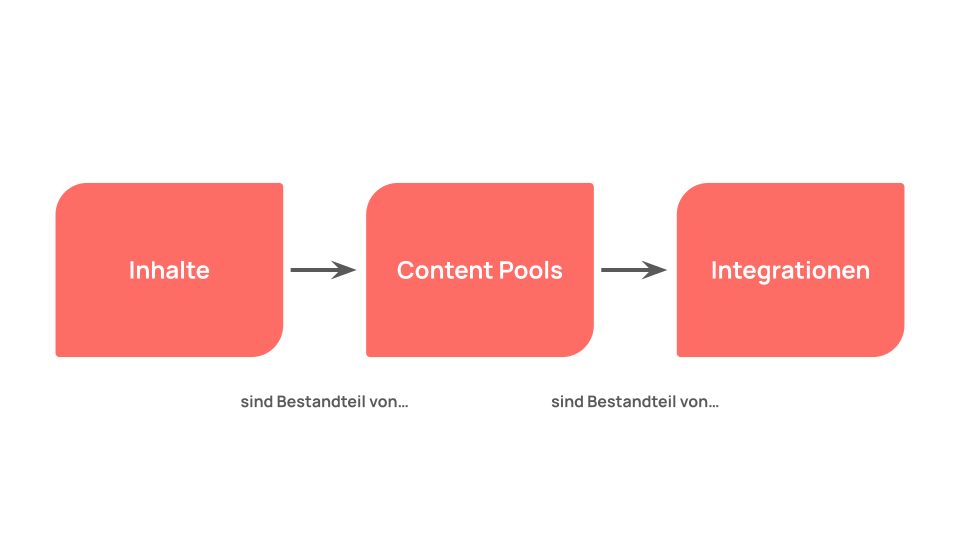

# Content Workflow

## Inhalte
Jeder Inhalt gehört zu einer Entität (Inhaltstyp). Mit dem einfach verständlichen und modern gestalteten Content Editor können Inhalte effizient erstellt, bearbeitet und kopiert werden. Mehr zum Thema Inhalt findest du auf den Seiten --> Content Editor und --> Entitäten

## Content Pools
Content Pools funktionieren wie Ordner für Dateien auf einem Computer und dienen dazu, Inhalte für unterschiedliche Anwendungszwecke zu organisieren und zu automatisieren. Es gibt zwei Typen von Content Pools in Flyo (kuratierte und regelbasierte). --> Mehr zu Content Pools 

## Integrationen
Als Integration bezeichnen wir die Verbindung von Flyo zu einem externen Kanal oder einber Applikation. Zu jeder Integration gehört eine Konfiguration sowie ein oder mehrere Content Pools, welche die Inhalte beinhalten, die in der Integration verwendet werden. Es können beliebig viele Integrationen konfiguriert und parallel mit unterschiedlichen Inhalten bespielt werden.

Folgende Integrationen stehen aktuell zur Verfügung:
- Webseiten --> Embed Codes, Flyo Headless CMS, Webflow
- Newsletter --> Mailjet
- Digital Signage --> SignageOS
- Social Media --> Facebook, Instagram, X (vormals Twitter), LinkedIn
- API/SDK --> Entwicklung eigener Frontends (Unterstützung für Frameworks (Laravel, NuxtJS) und SDK-Clients für PHP, JS und Vue)
- OpenAPI-Format --> Entwicklung eigener Adapter (z.B. Java)

### Werkzeuge
Entlang des Content Workflows bietet Flyo einige Tools, um das Content Management so einfach wie möglich zu gestalten:

- Benutzerrollen -->
- Cross Check -->
- Notizen -->
- Aufräumen -->
- Datenqualität -->
