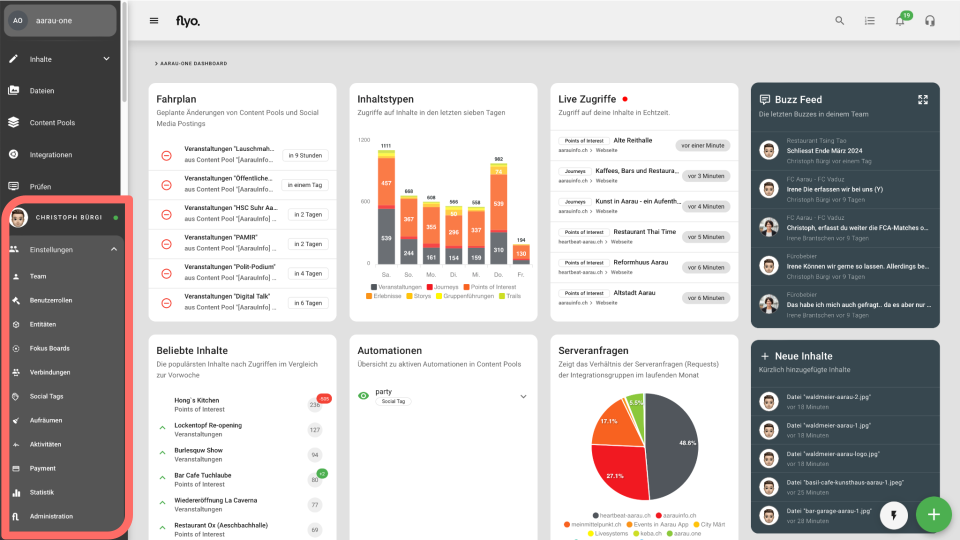

# Einstellungen

In den Einstellungen werden Standards zum ganzen Account festgelegt. Zum Beispiel:
- **Zusammenarbeit** --> Teammitglieder und Berechtigungen verwalten
- **Inhalte** --> Entitäten, Sprachen & weiteres verwalten
- **Eigenes Profil** --> Sicherheit, Benachrichtigungen & mehr

::: info Hinweis
Zugang nur mit den entsprechenden Berechtigungen. --> [Mehr Informationen](/howto/manage-permissions)
:::

## Persönliche Einstellungen
Die persönlichen Einstellungen des Benutzerprofils können durch Klick auf das Profilfoto / den Namen in der Hauptnavigation aufgerufen werden. Verfügbare Aktionen:

- **Meine Daten / Profil bearbeiten** —> Ändern der persönlichen Informationen, E-Mail, etc.
- **Dashboard** —>
- **Sicherheit** —>
- **Buzzes** -->
- **Benachrichtigungen** -->

## Team
Zeigt eine Übersicht der einzelnen Teammitglieder inkl. Benutzerrollen, letztem Login oder Sicherheitseinstellungen. Verfügbare Aktionen:

**Teammitglied bearbeiten**
- **Dashboard** —> Übersicht Account-Status, Aktive Login-Sessions, etc.
- **Daten **—> Anpassen persönlicher Daten wie E-Mail, Adresse, etc. sowie Aktivierung/Deaktivierung Flyo Update-Mail
- **Benutzerrollen** —> Anpassen der Benutzerrollen
- **Content Pools** —> Vergabe von Berechtigungen für Content Pools (Inhalte ansehen / bearbeiten / löschen / Onlinestatus ändern)
- **Integrationsgruppen** —> Freigabe von Integrationsgruppen (Ansehen / Bearbeiten / Löschen)
- **Fokus Boards** -> Freigabe von Fokus Boards

::: info Hinweis
FUNKTIONEN -> Manager, Externer Admin, Teammitglied
:::

**Teammitglied löschen**

Entzieht alle Berechtigungen und entfernt das Mitglied aus dem Team

**Neues Teammitglied hinzufügen**

Ein neues Teammitglied wird über den "Hinzufügen-Button" —> Teammitglied erstellt.

## Benutzerrollen
Zeigt eine Übersicht der verfügbaren Benutzerrollen sowie den einzelnen Rollen zugeordnete Teammitglieder. Verfügbare Aktionen:

**Benutzerrolle bearbeiten**
- **Dashboard** —> Übersicht zugeordneter Teammitglieder
- **Bearbeiten** —> Name & Beschreibung bearbeiten
- B**erechtigungen** —> Berechtigungen, die einer Benutzerrolle zugewiesen sind
- Benutzer —> Teammitglieder, die einer Benutzerrolle zugeordnet sind

**Benutzerrolle löschen**

Löscht eine Benutzerrolle unwiderruflich und entzieht allen Teammitgliedern die entsprechenden Berechtigungen

## Entitäten
Übersicht über alle Entitäten. Verfügbare Aktionen:

**Entität bearbeiten**

- **Dashboard** —> Auflistung aller Teammitglieder, die für eine Entität Inhalte erfassen dürfen sowie Anzeige der Anzahl erfasster Inhalte einer Entität
- **Bearbeiten** —> Definition der Felder und Konfiguration einer Entität (—> mehr dazu unter „Entität erstellen“

**Entität löschen**

Zu finden unter Bearbeiten. Entfernt die Entität unwiderruflich aus Flyo. Eine Entität kann nur gelöscht werden, wenn keine Inhalte mehr vorhanden sind.

## Fokus Boards
Übersicht über die erstellten Fokus Boards. Mehr zur Funktion und den Einstellungen für Fokus Boards —> Fokus Boards

## Verbindungen
- **Social Media** —> Verbinden und Entfernen von Facebook-, Instagram-, X (vormals Twitter)- und LinkedIn-Accounts
- **Integrationen** —> Übersicht über Verbindungen, die durch Integrationen erstellt wurden (z.B. Webflow, Mailjet, etc.). Wird eine Verbindung gelöscht, kann sie nicht reaktiviert werden. In diesem Fall muss via Integration eine neue Verbindung erstellt werden.
- **OpenAI** —> Hinterlegen von OpenAI API-Schlüssel zur Nutzung von KI-Funktionen in Flyo

## Social Tags
Feature wird entfernt.

## Aufräumen
Aufräumen bietet mehrere Optionen, um Ordnung im Content Management zu wahren und nicht mehr benötigte Inhalte zu entfernen. Verfügbare Aktionen:

- **Kuratierte Einträge** —> Liste von Content Pools, die möglicherweise nicht mehr benötigte Einträge beinhalten
- **Papierkorb** —> Inhalte, die in den Papierkorb verschoben wurden
- **Content Pools** —> Content Pools, die mit keiner Integration verbunden sind und möglicherweise nicht mehr benötigt werden
- **Inhalte** —> Inhalte, die älter sind und möglicherweise nicht mehr benötigt werden

## Aktivitäten
Logbuch mit allen Änderungen, die an Inhalten vorgenommen wurden. Es wird pro Änderungseintrag ein Vorher-Nachher-Vergleich angezeigt. Die Liste der Aktivitäten kann nach Teammitglied oder Aktivität (Inhalt hinzugefügt / aktualisiert) gefiltert werden.

## Payment
Übersicht über die Nutzung von Flyo, den genutzten Speicherplatz sowie die verfügbaren Credits.

## Statistik
Zahlen & Fakten zu Entitäten, Inhalten und Integrationen. —> Mehr zu Statistiken

## Administration
In diesem Bereich können die Grundeinstellungen für Flyo vorgenommen werden. Verfügbare Aktionen:

- **Daten** —> Ändern der Grundeinstellungen sowie Rechnungsinformationen
- **Sicherheit** —> Forcieren der 2-Faktor-Authentifizierung (2FA)
- **Prüfroutinen** —> Definieren, dass bei definierten Ausdrücken (RegExp) oder Textfragmenten in Inhalten eine Meldung durch Flyo ausgelöst wird
- **Sprachen & Zeitzonen** —> Definition der Sprachen, die für mehrsprachige Felder von Inhalten angezeigt werden sollen
