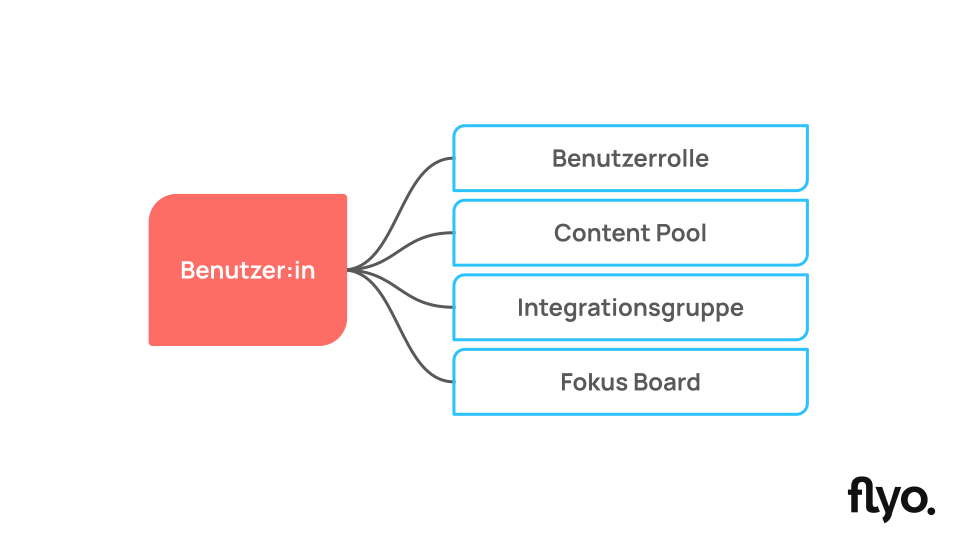

# Über Berechtigungen

## Allgemeines
Flyo bietet ein flexibles Berechtigungssystem, um vielfältige Content Workflows abbilden zu können.

Das Berechtigungssystem orientiert sich dabei am Konzept der Datensparsamkeit. Das meint im Kontext von Flyo, dass Berechtigungen proaktiv vergeben werden müssen und nicht standardmässig für neue Benutzer:innen gelten.

::: info Beispiel zur Datensparsamkeit
Wird ein neuer Content Pool erstellt, müssen die berechtiguten Benutzer:innen definiert werden. Standardmässig sind ausser den Benutzer:innen mit der Benutzerrolle "Manager" keine Benutzer:innen berechtigt.
:::

## Benutzerrollen
Mit Benutzerrollen können Berechtigungen für das Hinzufügen von Inhalten sowie für zentrale Funktionen in Flyo vergeben werden.

- Inhalte erstellen -> Legt für jede Entität fest, ob Benutzer:innen mit dieser Benutzerrolle neue Inhalte erstellen dürfen oder nicht
- Zentrale Funktionen in Flyo -> Definiert den Zugriff mit dieser Benutzerrolle auf folgende Funktionen
    - Aktivitäten -> Zugriff auf den globalen Änderungsverlauf aller Inhalte (Logbuch)
    - Verbindungen -> Verwalten der aktiven authenfizierungspflichtigen externen Dienste (z.B. Webflow-Verbindung)
    - Fokus Boards -> Erstellen, Bearbeiten, Löschen von Fokus Boards
    - Integrationen -> Hinzufügen neuer Integrationen
    - Integrationsgruppen -> Erstellen, Bearbeiten, Löschen von Integrationsgruppen
    - Payment -> Zugriff auf den aktiven Preisplan und Zahlungsmethode
    - Content Pools -> Erstellen, Bearbeiten, Löschen von Content Pools
    - Qualitätsprüfung -> Zugriff auf die Funktion zur automatisierten Qualitätsprüfung
    - Cross Checks -> Erhält Benachrichtigungen über Cross Checks und kann Inhalte online schalten
    - Benutzerrollen -> Erstellen, Bearbeiten, Löschen von Benutzerrollen
    - Entitäten -> Erstellen, Bearbeiten, Löschen von Entitäten
    - Social Media -> Kann via verknüpfte Social Media-Konten Inhalte publizieren
    - Statistiken -> Zugriff auf den Statistikbereich (gilt nicht für Statistiken im Dashboard)
    - Social Tags -> Erstellen, Bearbeiten, Löschen von Social Tags
    - Team -> Erstellen, Bearbeiten, Löschen von Teammitgliedern
 
::: info Erstellen, Bearbeiten, Löschen
Die Berechtigungen für Erstellen, Bearbeiten, Löschen können seperat vergeben werden, z.B. nur erstellen oder nur bearbeiten und löschen, etc.
:::

## Content Pools
Mit der Berechtigungslogik für Content Pools wird in erster Linie gesteuert, welche Teammitglieder mit welchen Inhalten in Flyo arbeiten dürfen.

Für jeden Content Pool kann definiert werden, welche Benutzer:innen Inhalte ansehen, bearbeiten, löschen oder den Onlinestatus ändern dürfen.

- Inhalte ansehen -> Das Teammitglied kann einen Inhalt anschauen, aber keine Änderungen vornehmen. Inhalte in diesem Content Pool sind über die Suche auffindbar und können kuratierten Content Pools hinzugefügt bzw. daraus entfernt werden.
- Inhalte bearbeiten -> Das Teammitglied kann Inhalte in diesem Content Pool bearbeiten.
- Onlinestatus ändern -> Das Teammitglied kann Inhalte in diesem Content Pool online bzw. offline schalten.
- Inhalte löschen -> Das Teammitglied kann Inhalte aus diesem Content Pool (nicht aber den Content Pool selber) löschen.

Die Berechtigungen können entweder via Content Pools -> Content Pool X -> Bearbeiten -> Berechtigungen auf der Ebene eines Content Pools oder über Einstellungen -> Team -> Teammitglied bearbeiten -> Content Pools vergeben und bearbeitet werden.

::: info Was passiert, wenn Inhalt A in Content Pool 1 und 2 vorhanden ist, das Teammitglied aber nur auf Content Pool 2 berechtigt ist?
Sobald ein Teammitglied über einen Content Pool eine entsprechende Berechtigung hat, gilt diese Berechtigung auf Ebene Inhalt. Das Teammitglied kann Inhalt A also bearbeiten (oder ggf. auch löschen, etc.), auch wenn keine Berechtigung für Content Pool 1 vorliegt.
:::

::: info Eigene Inhalte
Inhalte, die mit dem eigenen Benutzeraccount erstellt wurden, können immer bearbeitet und gelöscht werden. Unabhängig davon, welche Berechtiugungen für Content Pools vorliegen.
:::

## Integrationsgruppen
Mit Berechtigungen für Integrationsgruppen wird gesteuert, welche Teammitgliedern Zugriff auf die Integrationen einer Integrationsgruppe haben. Die Berechtigung für eine Integrationsgruppe gilt immer für alle Integrationen in dieser Gruppe.

- Integrationen ansehen -> Teammitglied kann Integrationen ansehen aber keine Änderungen vornhemen.
- Integrationen bearbeiten -> Teammitglied kann alle Integrationen inkl. allen Einstellungen einzelner Integrationen bearbeiten.
- Integrationen löschen -> Teammitglied kann Integrationen unwiderruflich löschen.

Die Berechtigungen können entweder via Integrationen -> Integrationsgruppe X -> Gruppe bearbeiten -> Bearbeiten -> Berechtigungen auf der Ebene einer Integrationsgruppe oder über Einstellungen -> Team -> Teammitglied bearbeiten -> Integrationsgruppen vergeben und bearbeitet werden.

::: info Tipp
Unbeabsichtige Änderungen oder falsche Einstellungen können zu Fehlern in Integrationen und der Datenvearbeitung führen. Wir empfehlen, diese Berechtigungen zurückhaltend zu vergeben.
:::

## Fokus Boards
XXX

- Fokusboard ansehen
