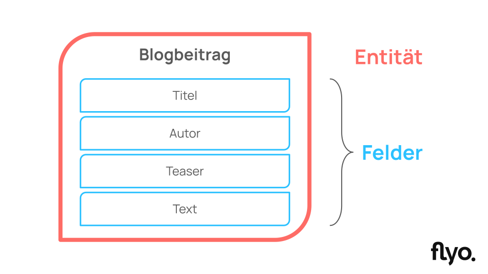

# Entität erstellen

## Neue Entität erstellen
Eine neue Entität wird über den "Hinzufügen-Button" -> Entität erstellt.

### Templates
Templates beinhalten vorkonfigurierte Felder, die zum Template passen. Du kannst jederzeit weitere Felder hinzufügen oder bestehende Felder entfernen.

Du kannst für die neue Entität entweder ein Template wählen oder die Felder komplett selber definieren.

### Titel & Allgemeine Informationen
Definiere Titel, Icon und eine Farbe der neuen Entität.

::: info Soll ich die neue Entität einer Integrationsgruppe zuweisen?
In vielen Fällen kannst du diese Option auslassen. Du kannst die Entität dann einer Intergationsgruppe zuweisen, wenn die Inhalte für diese Entität z.B. als Filterkategorien für eine Webseite verwendet werden sollen. Die Entität wird dann nicht im Content Editor in der Hauptnavigation angezeigt, sondern in der entsprechenden Integrationsgruppe angezeigt. Der Funktionsumfang bleibt unverändert.
:::

### Felder
Definiere die Felder (Bausteine), aus denen sich die neue Entität zusammensetzt.

Für jedes Feld kannst du bestimmte Einstellungen vornehmen:

- Label --> So wird das Feld im Content Editor beschriftet (z.B. Titel)
- Identifier --> Eindeutiger Identifikator (z.B. titel)
- Hilfetext --> Hinweistext, der im Content Editor angezeigt wird
- Feldtyp --> Eigenschaft, die für das Feld gilt (z.B. Textfeld)
- Validierung --> Konformität, die für dieses Feld eingehalten werden muss
- Zwingendes Feld --> Muss im Content Editor das Feld zwingend ausgefüllt werden?
- Mehrsprachiges Feld --> Ist das Feld mehrsprachig? (z.B. Titel in Deutsch, Englisch, etc.)
- Feldinhalt darf nur einnmal vorkommen --> Darf ein bestimmter Inhalt in diesem Feld einmalig oder mehrfach vorkommen?

::: info Mehrsprachigkeit
Folgt.
:::

### Standard-Interface
Für bestimmte Funktionen in Flyo ist es wichtig, dass bestimmte Attribute einem Feld zugeordnet sind.

### Berechtigungen
Hier kannst du definieren, welche Benutzerrollen Inhalte für die neue Entität erstellen dürfen.

::: info Wo kann ich regeln, wer Inhalte bearbeiten oder löschen darf?
Folgt.
:::

::: info Was passiert nach dem Speichern?
Wenn du die neue Entität erstmalig speicherst, erstellt Flyo automatisch einen Content Pool für diese Inhalte. Dieser Content Pool kann nicht gelöscht werden und enthält stets alle Inhalte, die für diese Entität erstellt werden.
:::
