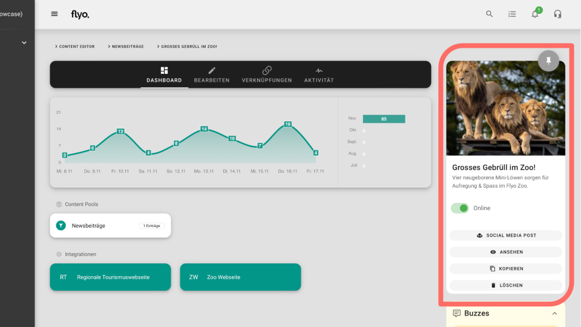

# Onlinestatus 

## Onlinestatus von Inhalten

Wenn ein Inhalt online geschaltet ist, wird dieser Inhalt über Integrationen zur Verfügung gestellt. Ist ein Inhalt zum Beispiel auf einer Webseite eingebunden, wird er dort angezeigt.

Wenn ein Inhalt offline geschaltet wird, wird der Inhalt auf allen Integrationen deaktiviert.

Du kannst den Onlinastatus über das Dashoard des entsprechenden Inhalts ändern.

Flyo zeigt dir mit einem roten (offline) bzw. grünen (online) Punkt an verschiedenen Stellen in der Oberfläche den Onlinestatus eines Inhalts an.

## Onlinestatus von Integrationen

Wenn du eine Integration temporär nicht benötigst, kannst du diese offline schalten.

Öffne dazu die Integration und klicke im Tab "Bearbeiten" auf den Toggle Online/Offline. Ist eine Integration offline geschaltet, werden keine Inhalte über diese Integration ausgespielt.

Um Ressourcen (Credits) zu sparen, kannst du nicht benötigte Integrationen offline schalten, wenn du sie nicht benötigtst.
