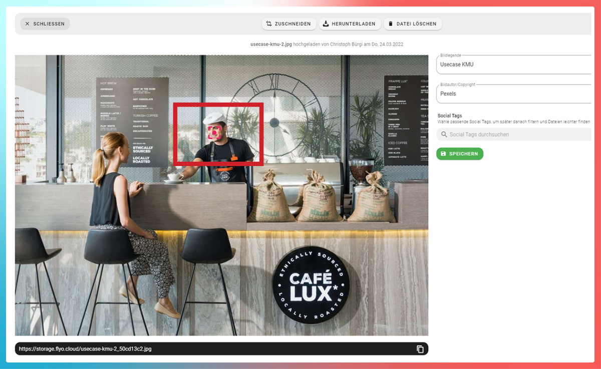
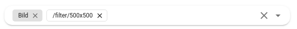

# Bilder (Proxy)

Unter `https://storage.flyo.cloud/{DATEI}` sind alle Bild-Dateien aufrufbar. Um eine kleinere Version eines Bildes aufzurufen, können untenstehende Adressen verwendet werden. Dabei gibt es 2 Arten von Adressen welche benutzt werden können um einen Filter zu erzeugen:

| Aufbau        | Beispiel           
| ------------- |-------------
| `{DATEI}/thumb/{BREITE}x{HÖHE}`|`example.jpg/thumb/300x300`
| `filter/thumb/{BREITE}x{HÖHE}/{DATEI}`|`filter/thumb/300x300/example.jpg`

Anstelle von Datei den Dateinamen eingeben und anstelle von Breite und Höhe die gewünschte Grösse in Pixel. Um eine Seite dynamisch zu berechnen kann der Wert `null` verwendet werden. 

Ein Beispiel mit der Original Bild Datei `https://storage.flyo.cloud/integrationsgruppe-flyowebseite_7a158241.jpg`:

<figure>
  
</figure>

| Grösse      | Beispiel           
| ------------- |-------------
| 250x250       |Gleiche Höhe und Breite definiert:<br /><br />
| 250xnull       |Höhe dynamisch berechnet anhand der Breite mit dem originalen Seitenverhältnis:<br /><br />
| nullx250       |Breite dynamisch berechnet anhand der Höhe mit dem originalen Seitenverhältnis:<br /><br />

## Fokus

Manchmal kommt es vor (gewollt oder ungewollt), dass das wichtigste Element in einem Bild nicht genau in der Mitte liegt. Aus diesem Grund kannst du in Flyo bei jedem Bild einen Fokuspunkt definieren. Sobald du bei einem Bild einen Fokuspunkt setzt, wird das Bild auf diesen Punkt zentriert. Du kannst den Fokuspunkt setzen oder verschieben, in dem du mit der Maus an die entsprechende Stelle im Bild klickst. Der Fokuspunkt wird angewendet, sobald das entsprechende Bild mit einem URL-Filter aus Flyo abgerufen wird. Achtung: eine bestimmte Bildstelle zu zentrieren, bedeutet immer, dass das Bild zugeschnitten werden muss - darum wirst nur dort einen Effekt sehen, wo das Bild zugeschnitten wird. Wenn der Fokuspunkt zu nahe am Rand liegt im Verhältnis zum gesamten Bildausschnitt, wird er nicht zentriert werden können. Dennoch hilft er dabei, den idealen Bereich auszuschneiden.

::: tip
Der Fokus kommt nur bei Zuschneidungen **ohne dynamische** Seitenverhätlnisse zum tragen. Konkret heisst das, das `250x250` den Fokus verwenden würde, aber `250xnull` nicht.
:::



## Filter und Mapping

Beim Mapping von Integrations-Feldern kann i.d.R auch direkt ein Filter angewendet werden, um eine bestimmte Grösse der Bilder zur Verfügung zu stellen:



## Download

Standardmässig werden die Bilder und Dateien im Browser angezeigt (Disposition Inline). Wenn stattdessen das Bild oder die Datei automatisch heruntergeladen werden soll, kann dem Link die Ergänzung `?download=1` angehängt werden (also z.B. `https://storage.flyo.cloud/{DATEI}?download=1`).

```
https://storage.flyo.cloud/integrationsgruppe-flyowebseite_7a158241.jpg?download=1
```
