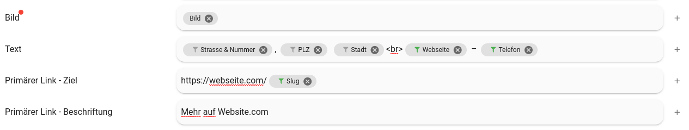
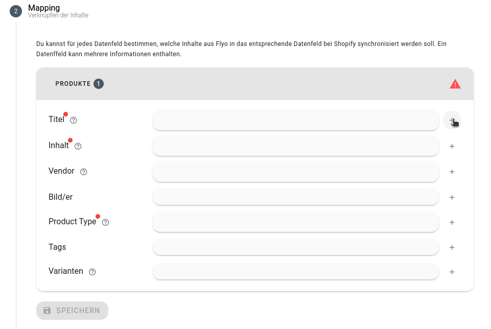

# Mappen von Inhalten

Mit dem Mapping von Inhalten werden mit Platzhaltern Inhalte in Integrationen zur Verfügung gestellt. Das Mappen von Inhalten in Flyo erlaubt: 

+ Das dynamische Auslesen und Formatieren von Werten
+ Das Einfügen von statischen Informationen

::: tip Tipp
Es können mehrere Inhalt in einem einzigen Feld gemappt und mit statischen Inhalten kombiniert werden.
:::

Beispiel für das Mappen von Inhalten in Flyo:

## Dynamische Inhalte mappen

Der Wert, der mit der entsprechenden Information gemappt werden soll, kann via Dropdown ausgewählt werden. Gewisse Werte erlauben zusätzlich eine Formatierung. Beispiel: Der Beginn einer Veranstaltung kann als Unix Timestamp oder als formatiertes Datum ausgegeben werden. Es können mehrere dynamische Inhalte mit einem Feld gemappt werden und z.B. mit statischen Inhalten voneinander getrennt werden (siehe unten).

## Statische Inhalte einfügen

Vor, nach oder zwischen dynamischen Inhalte können statische Inhalte eingefügt werden. Nach dem dynamischen Inhalt muss der Wert mittels Tabulator-Taste "fixiert" werden. Beispiele sind:
+ Veranstaltungsbeginn: {dynamischer Wert}
+ Leerzeichen, Kommas, Pipes, etc. für Abstände zwischen Informationen
+ HTML-Ausdrücke wie ` ` für Zeilenumbrüche
