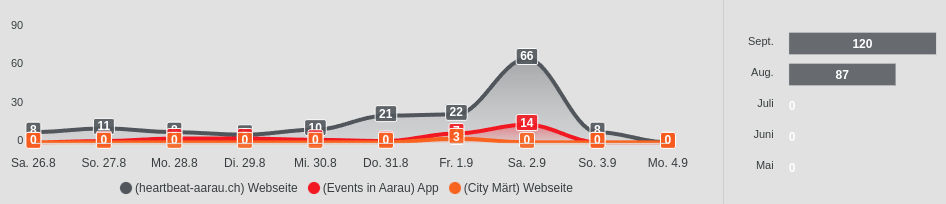
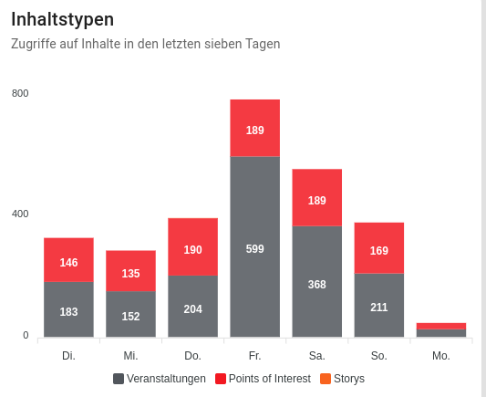
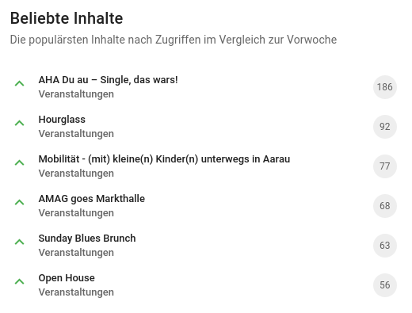
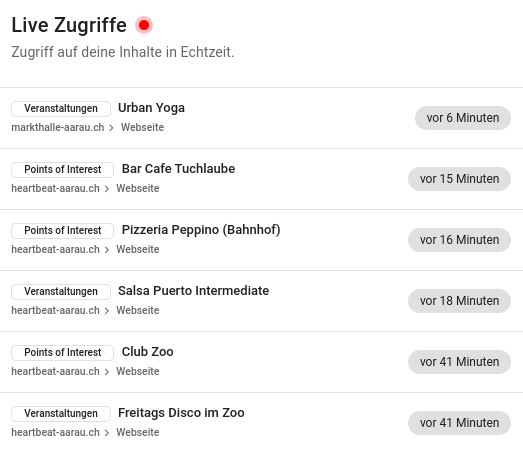

# Metriken



Jede Integration bietet out-of-the-box eine Anbindung in die `Flyo Metrics` (Statistiken) in Form eines Tracking Pixels oder einer Schnittstellen-URL, welche aufgerufen werden kann. Die Metriken messen, wie oft Inhalte aufgerufen werden und geben dem Benutzer einen Anhaltspunkt über die Reichweite der publizierten Inhalte.

::: tip
`Flyo Metrics` ist nicht zu verwechseln mit `Requests`. Requests zählt die Schnittstellen Anfragen, die an die Flyo Cloud gemacht werden.
:::

## Was gilt als Impression?

+ Webflow, API, SDK, Nitro: Misst eine Impression, sobald die Tracking-URL aufgerufen wird. Vergleichbar mit einem klassischen Seitenaufruf.
+ Embed Codes: Misst eine Impression, sobald ein Eintrag für mindestens 4 Sekunden zu 75% im sichtbaren Bildschirmbereich ist. Das Tracking geschieht automatisch und muss nicht aktiviert oder zusätzlich implementiert werden.
+ Signage OS: Misst eine Impression, sobald der generierte QR-Code auf einer Signage-Folie gescannt wurde. Vergleichbar mit einem Klick auf einer Webseite.
+ Webseite Baukasten: Misst eine Impression, wenn die Detailseite eines Inhalts aufgerufen wird. Das Tracking geschieht automatisch und muss nicht aktiviert oder zusätzlich implementiert werden.
+ Map: Misst eine Impression, wenn ein Eintrag in der Map angeklickt und der weiterführende Link aufgerufen wird. Das Tracking geschieht automatisch und muss nicht aktiviert oder zusätzlich implementiert werden.

## Einbau via Tracking Pixel

Das Tracking Pixel ist für HTML-Seiten geeignet oder Seiten ohne dedizierte Backend-Entwicklung. Es ist ein 1x1 Pixel grosses Bild ohne Ausgabe und kann somit an jeder Stelle auf der Seite eingebunden werden. Diese Art des Tracking Pixel kommt beispielsweise bei Webflow zum Einsatz.

```html

```

## Einbau via API URL

Die API kann für Backend- und Frontend-Anwendungen genutzt werden. Die URL beinhalten keine CORS Restriktionen und können somit auch direkt im Frontend aufgerufen werden.

Beispiel mit JavaScript [fetch](https://developer.mozilla.org/en-US/docs/Web/API/Fetch_API/Using_Fetch):

```js
fetch('https://api.flyo.cloud/FLYO_CLOUD_METRIC_API_URL')
```

Beispiel mit PHP [curl](https://www.php.net/manual/en/book.curl.php):

```php
<?php
$ch = curl_init();
curl_setopt($ch, CURLOPT_URL, "https://api.flyo.cloud/FLYO_CLOUD_METRIC_API_URL");
curl_exec($ch);
curl_close($ch);
```

## Mehrere Einträge via API

Es kommt vor, das mehrere Tracking-Anfragen gleichzeit in einen Request gepackt werden sollen, um, die Wartezeit innerhalb des Scripts (Stichwort IO Blocking) zu verkürzen und die generelle Laufzeit des Scripts zu verringern. Um mehrere Tracking-Hashes zu senden, kann der Endpunkt: `https://api.flyo.cloud/integration/metrics` mittels `POST` request mit `Content-Type: application/json` aufgerufen werden. Das Array muss jeweils die hashes oder alternativ die API-URL (die den hash ebenfalls enthält) beinhalten.

Hier ein Beispiel Payload welcher auch in Kombination funktioniert:

```json
[
    "https://api.flyo.cloud/integration/metric/h/5f1b6641a7af7ee4-46-schema",
    "3d8dd5075f5db664917-58-schema",
]
```

## Dashboards

Das Dashboard zeigt die Zugriffe der letzten 7 Tage an:



Inhalte werden basierend auf ihrer Popularität sortiert und angezeigt. Dies bedeutet, dass die am meisten geschätzten und häufigsten angesehenen oder gelesenen Inhalte in der Liste ganz oben erscheinen, während weniger beliebte Inhalte weiter unten platziert werden:



In Echtzeit können wir verfolgen, welche Inhalte gerade abgerufen werden. Dies ermöglicht uns, aktuelle Informationen über die Nutzung unserer Plattform zu erhalten und gegebenenfalls schnell auf Trends oder Bedürfnisse unserer Nutzerinnen und Nutzer zu reagieren:



Über die einzelnen Integrationen werden die Zugriffe auf die Entität sichtbar gemacht:


