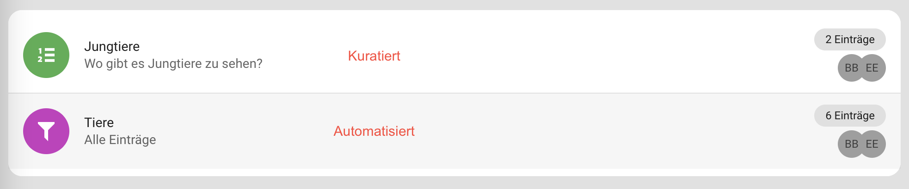
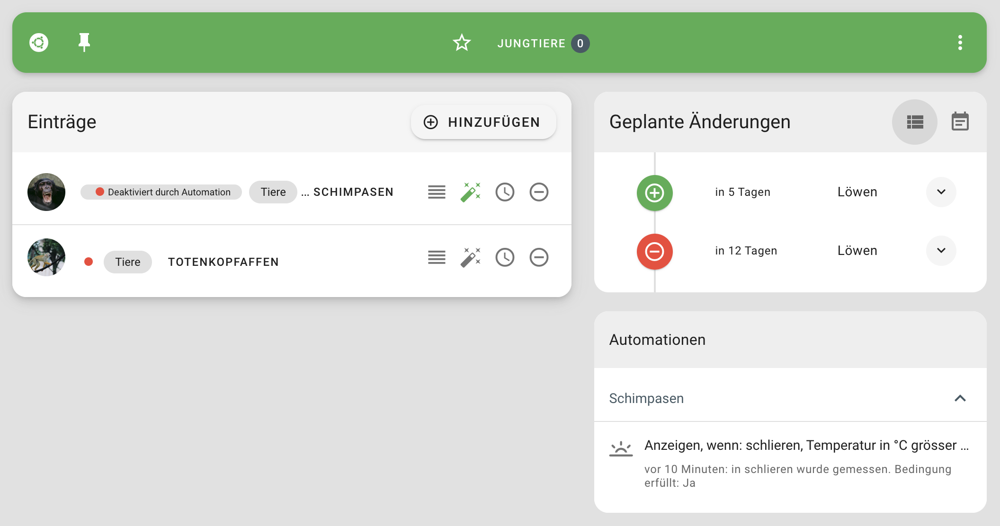
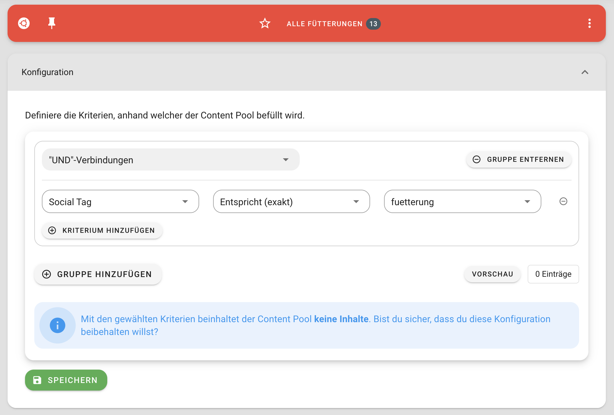

# Content Pools

Content Pools sind Gefässe, welche Daten beinhalten. Es gibt zwei Arten von Content Pools:

+ Kuratierte Content Pools
+ Automatisierte Content Pools

## Kuratierte Content Pools

Kuratierte Content Pools (Streams): die Inhalte werden manuell zum Pool hinzugefügt und wieder entfernt.

## Automatisierte Content Pools

Automatisierte Content Pools (Datenfilter): die Inhalte werden auf Basis einer oder mehreren Eigenschaften automatisch zusammengezogen (z.B. anhand einer Postleitzahl und eines Social Tags)

