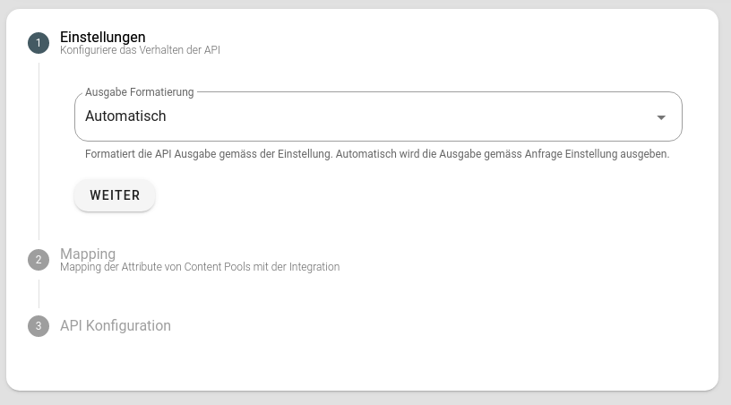

# API Integration

Die API-Integration erlaubt es, Content Pools über eine REST API auszugeben. Jede Zeile (Row) aus der API beinhaltet ein zusätzliches Feld `metric`, um die Impressionen messen zu können. Siehe dazu auch [Flyo Metrics System](../infos/metrics).

## Parameter

Es git optionale Parameter für die REST API URLs, welche an die bestehende Adresse mittels query parameter angehängt werdem können. Als Beispiel: `?_lang=en&_format=xml`.

#### Sprache

`_lang` definiert die Sprache, welche für die Ausgabe der Daten oder die lokale Formatierung verwendet werden soll.

#### Format

`_format` Definiert das Format, welches zurückgegeben wird. Verfügbare Werte sind `json` und `xml`.

Die Formatierung funktioniert nur wenn in den Einstellungen der Integration die Option `Ausgabe Formatierung` auf `Automatisch` aktiv ist.

