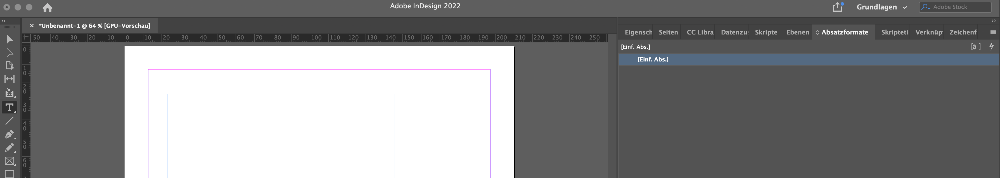
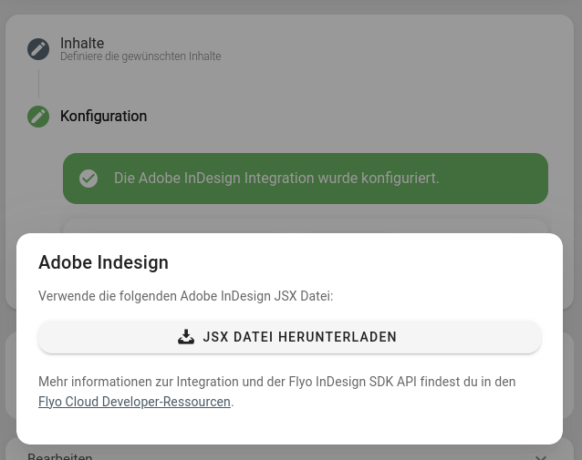
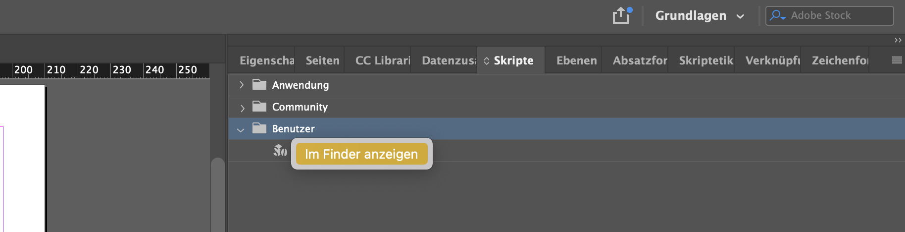
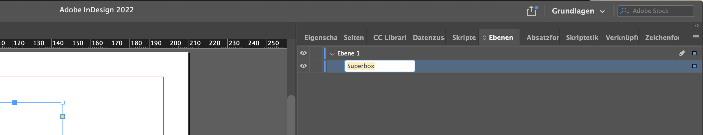
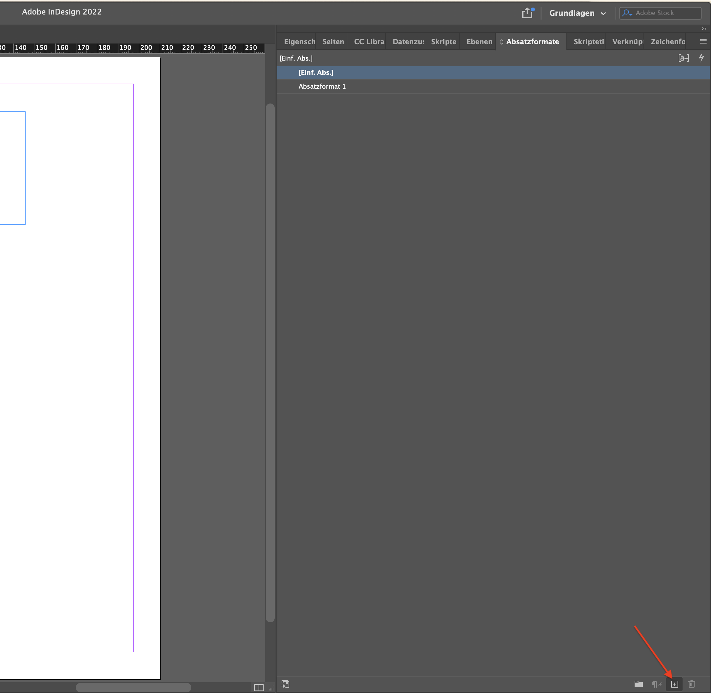

# Adobe Indesign Integration

[Adobe InDesign](https://www.adobe.com/ch_de/products/indesign.html) ist das führende Layout- und Designtool für Desktop Publishing. Mittels Skript-Funktion in InDesign (JSX-Datei) lassen sich Inhalte aus Flyo automatisiert in InDesign-Dokumenten abbilden.

:::danger OSX
Damit das JSX-Skript die Inhalte aus Flyo laden kann, muss OSX über die Anwendung CURL verfügen.
:::

::: details OSX Curl prüfen und installieren
1) Öffne die Terminal-App: Drücke CMD + Leertaste, tippe Terminal ein und drücke Enter
2) Tippe `curl -h` und drücke Enter. Wenn dort angezeigt wird "Curl not found", folge der Anleitung. Wenn ganz viel Zeilen Code kommen, hast du Curl und kannst die anderen Schritte überspringen.
3) Kopiere folgenden Code ins Terminal und drücke Enter:
`/bin/bash -c "$(curl -fsSL https://raw.githubusercontent.com/Homebrew/install/HEAD/install.sh)`
3) Du wirst zur Eingabe deines Passworts aufgefordert. Gib es ein und drücke Enter. Achtung, du siehst die eingegebenen Zeichen nicht im Terminal.
4) Nun installiert dein Mac Homebrew, ein Paketmanager für macOS (https://brew.sh/)
5) Nachdem die Installation abgeschlossen ist, tippe `brew install curl` ins Terminal-Fenster und drücke erneut Enter.
6) Warte, bis der Prozess abgeschlossen ist. Nun ist Curl installiert und du kannst die Indesign-Integration nutzen.
:::

## Indesign vorbereiten: benötigte Fenster einblenden

Blende die später benötigten Fenster ein. Klicke dazu im Menü am oberen Bildschirmrand auf "Fenster" und wähle je einmal
- Fenster / Hilfsprogramme / Skripte
- Fenster / Formate / Absatzformate
- Fenster / Ebenen




## JSX-Script ins Indesign laden



Speichere das JSX-Script in folgendem Ordner, damit es in Indesign angezeigt wird:

So findest du den Ordner „Scripts Panel“ am einfachsten: Klicke mit der rechten Maustaste (Windows) bzw. bei gedrückter Ctrl-Taste (Mac OS) auf ein Skript oder den Ordner "Benutzer" im Skriptbedienfeld und wähle „Im Explorer anzeigen“ (Windows) bzw. „Im Finder anzeigen“ (Mac OS). Dies führt dich ins Verzeichnis Scripts Panel. Und genau hier rein kopierst du das InDesign-Script aus Flyo.



Wenn du das Script richtig platziert hast, wird es dir anschliessend im Skript-Bedienfeld im Ordner Benutzer angezeigt.

## Textbox erstellen und richtig benennen

Erstelle mithilfe des Textwerkzeugs aus der Werkzeugleiste an linken Bildschirmrand (Tastenkürzel T) eine Textbox. Wechsle ins Bedienfeld "Ebenen" und gib deiner Textbox denselben Namen, wie du in Flyo definiert hast.



## Absatzformate erstellen

Wechsle ins Absatzformate-Bedienfeld und klicke unten rechts auf das kleine Plus, um ein neues Absatzformat zu erstellen.

Indesign erstellt dadurch nummerierte Absatzformate "Absatzformat 1, 2, ..." und zeigt diese im Absatzformat-Bedienfeld an.

Doppelklicke auf ein Absatzformat, um es zu bearbeiten. Gib dem Format einen eindeutigen Namen und stelle Schriftart, Zeilenabstände, Einzüge etc. wie gewünscht ein.



## Skript ausführen

Wechsle ins Bedienfeld "Skripte" und doppelklicke auf dein Script. Wenn alles richtig vorbereitet ist, passiert nun die Magie und die Inhalte aus Flyo werden vollautomatisch in deine Vorlage gefüllt.

## Custom Code

Um die im Flyo definierten Boxen und Inhalte anzusprechen können folgenden Funktionen verwendet werden:

```js
flyo.forEachBoxes(function(box) {

    alert(box.textBoxName)

    flyo.forEachBoxItems(box, function(item) {
        
        alert(item.styleName)
        alert(item.value)
    })
})
```
