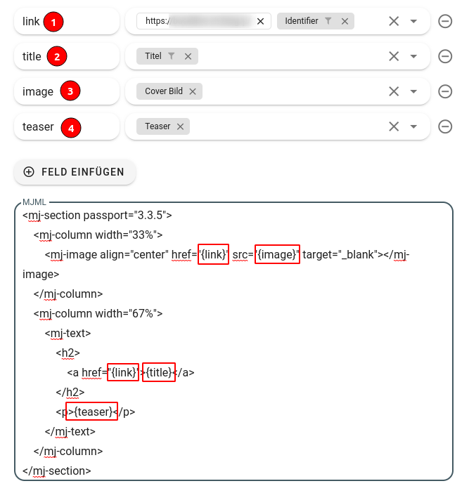

# Mailjet Integration

[Mailjet](https://mailjet.com) ist ein Dienst zum Versenden von E-Mails. Aus Flyo lassen sich Kontakte und Inhalte synchronisieren. Die Inhalte werden als sogenannte Sections an Mailjet gesendet und stehen danach dort im Drag-n-Drop Editor unter "gespeicherte Abschnitte) zur Verfügung. Die Kontakte werden der gewählten Kontaktliste hinzugefügt.

## API Key und Secret einrichten

Beim Ausetzen der Integration in Flyo muss zuerst eine Mailjet-Verbindung ausgewählt werden. Falls noch keine besteht, muss eine neue Verbindung erstellt werden. Dazu wird ein API-Key und der API-Geheimcode seitens Mailjet benötigt. Dieser findet sich Konto-Einstellungen / REST API / API-Key.
Seitens Mailjet kann pro Konto resp. Unterkonto nur 1 API-Key gelöst werden. Das dazugehörige Secret kann nur beim erstmaligen Erstellen angeschaut werden. Muss zu einem späteren Zeitpunkt eine weitere Verbindung hergestellt werden, muss ein neues Secret generiert werden und allfällige andere, bestehende Verbindungen entsprechend aktualisiert werden.

## Synchronisation von Inhalten (Sections / Abschnitten)

Dieser Integrationstyp sendet Inhalte aus Flyo (POIs, Events, Story, Custom Entitäten) als sogenannte Sections resp. Abschnitte zu Mailjet. Die bereits synchronisierten Abschnitte können unter [Gespeicherte Abschnitte](https://app.mailjet.com/passport/sections) angeschaut, bearbeitet, gelöscht werden.

Die Synchronisation geschieht grundsätzlich in Echtzeit, d.h. eine einmal synchronisierter Inhalt wird bei einer Änderung in Flyo auch in Mailjet aktualisiert.
- Ein Inhalt wird erstmals an Mailjet gesendet, wenn er zu einem synchronisierten Pool gehört und online ist.
- Einmal synchronisierte Inhalte lassen sich in Mailjet löschen, allerdings einen nach dem anderen und von Hand. Müssen viele Einträge gelöscht werden, ist das relativ aufwändig.
- Wir empfehlen, besonders für das initiale Setup einen Pool zu wählen mit wenigen Inhalten. Sollte die Synchronisation nicht wie gewünscht klappen, müssen nur ein paar wenige Abschnitte gelöscht werden.

Damit ein Inhalt im Drag-n-Drop Editor zur Verfügung steht, muss seitens Mailjet mit einer Vorlage gearbeitet werden, welche den Drag-n-Drop Editor unterstützt. D.h. wenn beim Bearbeiten der Vorlage nicht der Drag-n-Drop Editor erscheint, stehen die aus Flyo bezogenen Inhalte auch nicht zur Verfügung.

### Gestalten einer Section / eines Abschnitts in Mailjet

Die Sections werden im mjml-Format (Mailjet Markup Language) definiert, einem Framework zum Gestalten von responsiven E-Mails. Mehr dazu unter [mjml.io](https://mjml.io)

In dieser Section können verschiedene Variablen verwendet werden. Diese Variablen müssen dafür zuerst in Flyo definiert werden. Im untenstehenden Codebeispiel wäre eine Variable z.B. {image}, dieser Wert kann z.B. beim Synchronisieren von Storys mit dem Wert Coverbild gematcht werden. Beim Definieren der Variablen können statische und dynamische Elemente kombiniert werden, z.B. eine fixe URL (www.deinfrontend.com/) und der Identifier des Elements, um einen Link zum Erhalten. Nutze z.B. auch unsere [Bilder Proxy](/infos/images.md) und setze direkt im Mapping-Prozess einen Filter, der dein Bild verkleinert. Wenn du das Bild in verschiedenen Grössen brauchst, kann die Bilder-Proxy auch direkt im mjml-Code genutzt werden.



::: danger Wichtig
Das Template darf nur über eine `<mj-section>` verfügen und diese muss als erstes Element (root) hinterlegt sein.
:::

```html
<mj-section passport="3.3.5">
    <mj-column width="33%">
        <mj-image align="center" href="{link}" src="{image}" target="_blank"></mj-image>
    </mj-column>
    <mj-column width="67%">
        <mj-text>    
            <h2>
                <a href="{link}">{title}</a>
            </h2>
            <p>{teaser}</p>
        </mj-text>
    </mj-column>
</mj-section>
```

Für das obige Template Beispiel müssten die Variabeln `link`, `image`, `title` und `teaser` erstellt werden.

## Kontakt (E-Mails) Sync

::: warning Diese Seite ist noch im Aufbau
:::