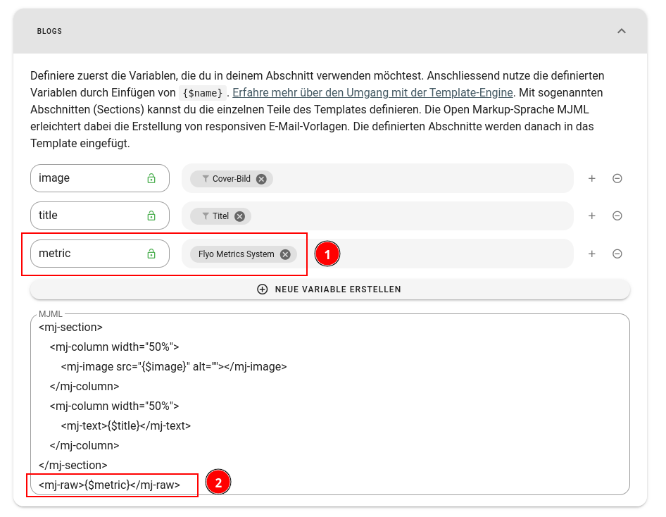

# Mailjet Integration

[Mailjet](https://mailjet.com) ist ein Dienst zum Versenden von E-Mails. Aus Flyo lassen sich Kontakte und Inhalte synchronisieren. Die Inhalte werden als sogenannte Sections an Mailjet gesendet und stehen danach dort im Drag-n-Drop Editor unter "gespeicherte Abschnitte) zur Verfügung. Die Kontakte werden der gewählten Kontaktliste hinzugefügt.


<iframe style="width:100%; margin-top:40px; margin-bottom:40px;" height="380" src="https://www.youtube.com/embed/zaXMbrjrswE" title="YouTube video player" frameborder="0" allow="accelerometer; autoplay; clipboard-write; encrypted-media; gyroscope; picture-in-picture; web-share" referrerpolicy="strict-origin-when-cross-origin" allowfullscreen></iframe>

## API Key und Secret einrichten

Beim Ausetzen der Integration in Flyo muss zuerst eine Mailjet-Verbindung ausgewählt werden. Falls noch keine besteht, muss eine neue Verbindung erstellt werden. Dazu wird ein API-Key und der API-Geheimcode seitens Mailjet benötigt. Dieser findet sich Konto-Einstellungen / REST API / API-Key.
Seitens Mailjet kann pro Konto resp. Unterkonto nur 1 API-Key gelöst werden. Das dazugehörige Secret kann nur beim erstmaligen Erstellen angeschaut werden. Muss zu einem späteren Zeitpunkt eine weitere Verbindung hergestellt werden, muss ein neues Secret generiert werden und allfällige andere, bestehende Verbindungen entsprechend aktualisiert werden.

## Templates

::: info Lerne die Basics Step by Step in diesem Blogpost.
https://www.flyo.ch/story/mailjet-flyo-integration
:::

## Beispielcode

Einfacher Newsletterabschnitt mit fünf Variablen für z.B. Blogartikel

```html
<mj-section background-color="#FFFFFF" padding="20px">
      <mj-column>
        <mj-image src="{$bild}" alt="Blog Image" border-radius="30px"/>
         <mj-text font-size="35px" line-height="42px" font-weight="700" color="#002D4F">{$titel}</mj-text>
        <mj-text font-size="16px" font-weight="400" line-height="19px" color="#002D4F">{$text}</mj-text>
        <mj-button align="left" background-color="#003246" color="white" border-radius="30px" href={$link}>Mehr</mj-button>
      </mj-column>
    </mj-section>
<mj-raw>{$metric}</mj-raw>
```

Einfaches Newsletterlayout mit einem Header und Footer sowie einem Editoral-Teil zur manuellen Befüllung.

```html
<mjml>
  <mj-head>
    <mj-attributes>
      <mj-all font-family="Verdana" />
    </mj-attributes>
    <mj-title>Newsletter</mj-title>
    <mj-style inline="inline">
      .content {
        padding: 20px;
      }
      .btn {
        background-color: #003246;
        color: white;
        border-radius: 30px;
        padding: 10px 20px;
        text-decoration: none;
        font-weight: 700;
        font-size: 14px;
        display: inline-block;
      }
      .highlight {
        color: #003246;
        font-weight: 700;
      }
      .footer-text {
        font-size: 14px;
        color: #FFFFFF;
      }
      .footer-link {
        text-decoration: none;
        color: #FFFFFF;
        font-weight: 600;
      }
    </mj-style>
  </mj-head>
  
  <mj-body background-color="#FFFFFF">
    <!-- Logo Section -->
    <mj-section background-color="#FFFFFF">
      <mj-column width="100%">
        <mj-image
          align="center"
          src="https://storage.flyo.cloud/14_097e4e57_logoflyofarbig.png"
          alt="Flyo-Logo"
          width="100px"
        />
      </mj-column>
    </mj-section>

    <!-- Title Section -->
    <mj-section
      background-color="#003246"
      padding="30px"
      padding-top="40px"
      border-radius="30px"
    >
      <mj-column>
        <mj-image
          src="titelbild"
          alt="Hero Image"
          border-radius="30px"
        />
        <mj-text
          font-size="35px"
          line-height="42px"
          font-weight="700"
          color="#FFFFFF"
        >
          titel
        </mj-text>
        <mj-text
          font-size="18px"
          color="#FFFFFF"
          line-height="22px"
          font-weight="700"
        >
          leadtext
        </mj-text>
        <mj-text
          font-size="16px"
          color="#FFFFFF"
          line-height="20px"
          font-weight="400"
        >
          Text Editorial
        </mj-text>
      </mj-column>
    </mj-section>

    <!-- Blogs Section -->
    <mj-section>
      <mj-column>
        <!-- Add your blogs content here -->
        Blogs
      </mj-column>
    </mj-section>

    <!-- Footer Section -->
    <mj-section
      background-color="#003246"
      padding="20px"
      border-radius="30px"
    >
      <mj-column width="100%">
        <mj-text
          font-size="14px"
          font-weight="400"
          color="#FFFFFF"
          align="center"
        >
          Dieser Newsletter wurde versandt von:
          <br />
          Flyo Zoo, Internetstrasse 77, 5000 Aarau
        </mj-text>
      </mj-column>
      <mj-column>
        <mj-text
          align="center"
          font-size="12px"
          color="#FFFFFF"
        >
          <a href="[[UNSUB_LINK_DE]]" class="footer-link">Newsletter abbestellen</a>
          <br />
          <a href="[[PERMALINK]]" class="footer-link">Im Browser anschauen</a>
        </mj-text>
      </mj-column>
    </mj-section>
  </mj-body>
</mjml>
```


### Iteration von Inhalten

Du kannst mit der [Template Engine](../dev/infos/template.md) Daten, zum Beispiel aus einer Relation, iterieren. Dafür verwendest du einen `foreach`-Block, der üblicherweise in einer Section eingesetzt wird, um die darin enthaltenen Elemente zu wiederholen. Standardmäßig konvertiert die Integration alle Array-Inhalte in eine kommagetrennte Liste, was für viele Situationen ausreichend ist. Wenn du jedoch das Array erneut benötigst, kannst du den Filter "Zeichenkette Teilen" verwenden, um aus der kommagetrennten Liste wieder ein Array zu erstellen, über das du anschließend mit `foreach` iterieren kannst.


```html
<mj-section>
    <mj-column>
        {foreach $labels as $label}>
            <mj-text>{$label}</mj-text>
        {/foreach}
    </mj-column>
</mj-section>
```

### Metrik Pixel

Um [Metriken](../dev/infos/metrics.md) für einen Newsletter einzurichten, müssen zunächst die Metrikdaten als Variable (1) verfügbar gemacht werden. Anschließend müssen sie innerhalb des jeweiligen Elements in ein `mj-raw`-Tag (2) eingebettet werden. Dies ermöglicht die effektive Verfolgung und Analyse von Newsletter-Metriken.



Beispielcode:

```html
<mj-section full-width="full-width">
    <mj-column width="50%">
        <mj-image src="{$image}" alt="" padding-bottom="20px" padding-top="20px"></mj-image>
    </mj-column>
    <mj-column width="50%" vertical-align="middle">
        <mj-text align="left">{$title}<br /><br />{$teaser}</mj-text>
    </mj-column>
</mj-section>
<mj-raw>{$metric}</mj-raw>
```

Wenn der Newsletter geöffnet wird und das Tracking-Pixel nicht von einem E-Mail-Client blockiert wird, erfolgt nun für jeden Eintrag eine Metrikerfassungsanfrage.
