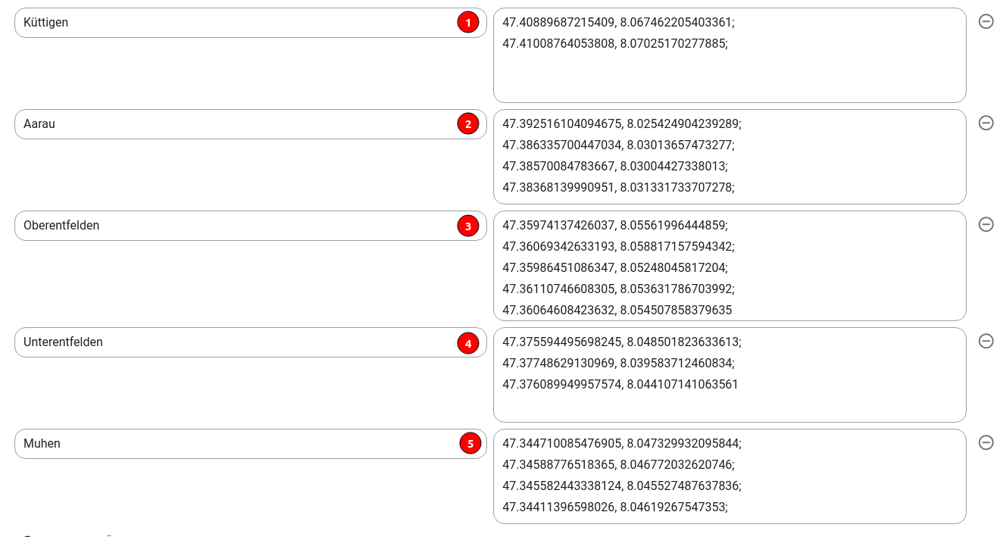

# Karte Integration

Die interaktive Karte wird mittels eines in Flyo generierten Embed Code eingebunden. Um Karteninhalte dynamisch laden zu können, stehen `Zentrieren` und `Standardfilter` als Optionen zur Verfügung.

## Integrieren

Beim Integrieren der Karte muss für das übergreifende HTML-Element eine Höhe und Breite definiert werden. Andernfalls wird die Karte nicht angezeigt.

```html
<div style="width:100%; height:100vh;">
    <map-interactive id="XXX" token="YYY"></map-interactive>
</div>
```

Die Karte selbst ("Shadow Element" `<map-interactive>`) hat stets eine Breite und Höhe von 100% und deshalb ist das übergreifende HTML-Element zur Definition der Breite und Höhe nötig.

Oft ist das Berechnen der Höhe ein Problem. Eine einfache Lösung bietet die CSS-Funktion calc und so die Höhe des Footers und/oder des Headers vom aktuellen Viewport (vh) abzuziehen:

```html
<div style="width:100%; height: calc(100vh - 120px);">
    <map-interactive id="XXX" token="YYY"></map-interactive>
</div>
```

::: tip Z-Index
Das Filter-Menu hat `z-index: 800`, die Zoom-Kontrollelemente `z-index: 1000`. Eine Navigation welche über den Map Controlls liegt, sollte also einen z-index von `1001` haben.
:::

## Parameter

Folgende Parameter stehen zur Verfügung:

+ api:
+ token*:
+ id*:
+ lat:
+ lng:
+ filters:

## Zentrieren

Die Eigenschaften `lat` und `lng` können den in Flyo **definierten Zentrierungspunkt überschreiben**, wobei valide Koordinaten angegeben werden müssen:

```html
<map-interactive
    id="..."
    token="..."
    lat="47.00"
    lng="8.0"
/>
```

## Standardfilter

Um Filter beim Initialen Laden der Karte zu aktivieren, kann die Eigenschaft `filters` mit einem Array mit Filtern übergeben werden. Die Zahl entspricht dem Index des Filters beim Erfassen:



Da Web-Komponenten keine Arrays übergeben können, wird das Array als Text übergeben. In einem dynamischen Kontext mit einem JavaScript Array muss `JSON.stringify()` verwendet werden.

```html
<map-interactive
    id="..."
    token="..."
    lat="47.00"
    filters="[1,3]"
/>
```

Beispiel mit Stringify und Vue computed data:

```js
export default {
    computed: {
        mapFilters: function() {
            return JSON.stringify([1,3])
        }
    }
}
```

...welche danach in das Element eingebunden werden kann:

```html
<map-interactive
    id="..."
    token="..."
    lat="47.00"
    :filters="mapFilters"
/>
```
