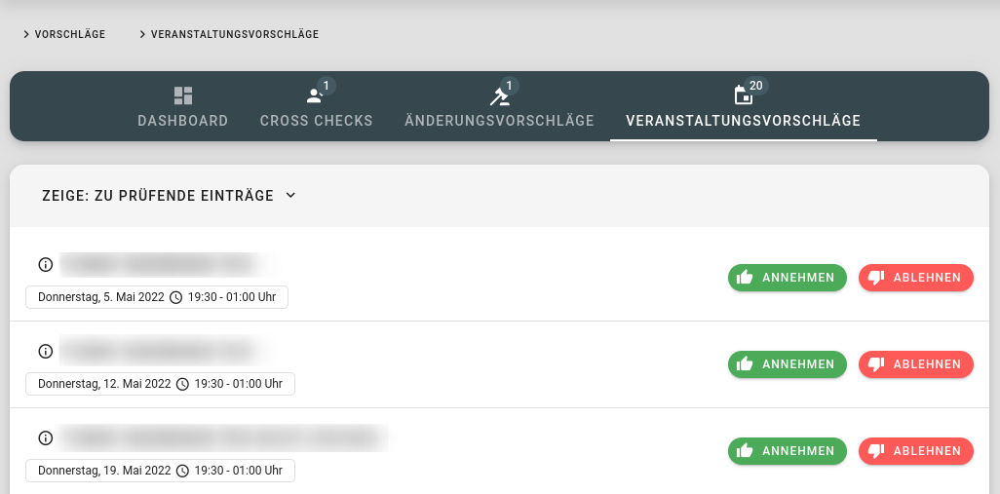
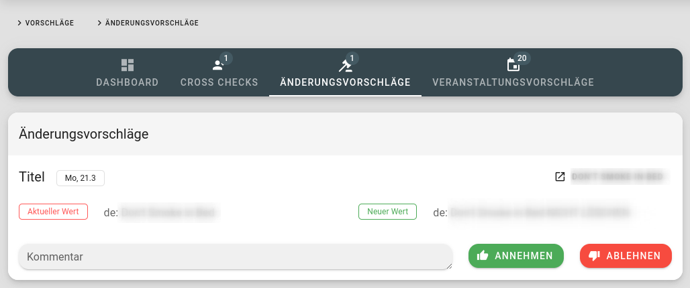
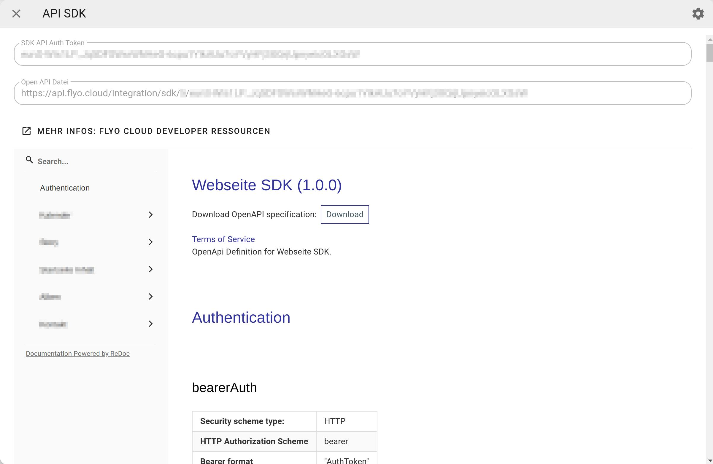

# API SDK Integration

Die Integration `API SDK` erstellt eine OpenApi-Datei mit den ausgewählten Pools. Die OpenApi-Datei kann mittels Generator in ein SDK verwandelt werden, welches der gewünschten Programmiersprache entspricht. Die OpenAPI-Datei beschreibt die Endpunkte und kann auch als Dokumentation verwendet werden, um die Endpunkte zu konsumieren ohne ein SDK zu generieren.

Alle Endpunkte sind automatisch für CORS Anfragen freigegeben.

## Öffentliche Schnittstelle

Wenn ein SDK öffentlich ist, wird kein Authorization Token verlangt. Zusätzlich werden die Endpunkte mittels Caching Technology um ein vielfaches schneller. Es lohnt sich also, die Schnittstelle öffentlich zu machen, solange nicht sensible Daten übertragen werden oder es wichtig ist, dass man den Authorization Token austauschen kann.

::: danger Recaptcha verifzierung
Wenn POST- und PUT-Requests auf einer öffentlichen Schnittstelle gemacht werden, müssen die Anfragen mittels Recaptcha verifziert werden!
:::

## Verifzieren von POST und PUT Requests

In einer SPA-Umgebung (JavaScript Seite, die direkte Aufrufe an die API macht) ist es für ein öffentliches SDK zwingend, die Anfragen zu verfizieren. In einer SPA-Umgebung empfiehlt es sich, dies auch für nicht öffentliche SDKs einzführen. 

::: tip
In einer SPA-Umgebung empfiehlt es sich immer, alle POST- und PUT-Request mittels Recaptcha zu validieren, das verhindert unnötige SPAM-Einträge und generiert somit weniger Anfragen.
:::

Für die Verifzierung verwenden wir [Google's Recaptcha V3](https://www.google.com/recaptcha/) Mechanismus. Das heisst, dass die SPA-Webseite beim Übermitteln von POST- und PUT-Requests einen Response Code lösen muss, über welchen Google Rcaptcha verfiziert, ob es sich um einen wirklichen Benutzer handelt. Dieser Response Code muss mittels `recaptcha_response` Bestandteil der Body Parameter sein. Flyo validiert diese Response serverseitig mit dem in Flyo definierten Secret. Bei einem Fehler wird ein `Validation Error` ausgegeben und der Request schlägt fehl.

Recpatcha JavaScript Framework Libraries:

+ [Nuxt.JS Recaptcha](https://www.npmjs.com/package/@nuxtjs/recaptcha)

### Eintrag erstellen (POST)

Einträge, welche über die API SDK Schnittstellen in Flyo erstellt werden, erhalten standardmässig den Status `zu prüfen` und erscheinen somit automatisch im Benutzer-Digest und der Benachrichtigungsleiste. Somit wird sichergestellt, dass die Einträge nicht direkt online sind. Man muss diese also von Hand onlineschalten oder, wenn der Datensatz fehlerhaft oder nicht benötigt wird, löschen. 

::: tip Events generieren Veranstaltungsvorschlag
Veranstaltungen haben einen speziellen Stellenwert. Aus diesem Grund werden im SDK die Veranstaltungen (Events) zuerst in den `Veranstaltungsvorschläge` Funnel hinzugefügt, von dort können diese angenommen oder abgelehnt werden.

:::

### Eintrag aktualisieren (PUT)

Wenn man via SDK einen Eintrag aktualisiert, wird ein `Änderungsvorschlag` generiert, welcher in Flyo angenommen oder abgelehnt werden kann. Ein Änderungsvorschlag überschreibt einen vorangegangenen Änderungsvorschlag. Will heissen, wenn man den Titel auf `Test 123` ändert und später via PUT auf `ABC 456` ist in Flyo nur der Änderungsvorschlag `ABC 456` vorhanden.



## Filter Parameter

Der Filter `?filter` Parameter erlaubt es, auf der Schnittstelle `where`-Konditionen zu setzen. Das ist ein starkes Tool, welches hilft, nur die gewünschten Daten aufzurufen. Der `?filter` Parameter muss jedoch als Array übergeben werden. Dazu einige Erklärungen und Beispiele. In der OpenAPI-Datei ist der Filter wie folgt beschrieben:

::: tip Filtering
Allows you to pass filtering options any attribute. `?filter[id]=123` or `?filter[author][like]=John`. Example of accessing nested array values `?filter[tags.alias]=food`
:::

Es können mehrere Anweisungen hintereinander eingefügt werden welche danach als `UND` Verbindungen zusammengefügt werden. Als Beispiel würde `?filter[email][like]=example.com&filter[is_active]=1` nun alle Daten zurück geben, bei welchen die E-Mail Adresse `example.com` beinhaltet **und** is_active auf 1 ist.

Folgende Operatoren können verwendet werden:

+ `eq` enstpricht `=` also equal - `?filter[email][eq]=john@example.com`
+ `neq` enstpricht  `!=` also not equal
+ `gt` enstpricht `>` also greater then - `?filter[created_at][gt]=12345678`
+ `gte` enstpricht `>=` also greater and equal then 
+ `lt` enstpricht `<` also lower then - `?filter[age][lt]=18`
+ `lte` enstpricht `<=` also lower and equal then
+ `like` enstpricht dem MYSQL `LIKE '%xyz%'` also enthält
+ `in` ist in einem Array enthalten (eine ODER Verbindung innerhalb des gewünschten Feldes)
+ `nin` ist *nicht* in einem Array enthalten (ODER Verbindung)

Ein wichtiges Element sind `nested elements`, wenn man z.B ein Array hat mit Tags wie die folgende Response:

```json
[
  {
    "id": 1,
    "title": "Flyo Cloud",
    "tags": [
      {
        "id": 1,
        "alias": "essen",
      },
      {
        "id": 2,
        "alias": "bar"
      }
    ]
  }
]
```

So ist es möglich alle Einträge zu Filtern, welche ein bestimmtes nested element beinhalten. Um auf ein nested element zuzugreiffen, wird ein `.` verwendet, also `tags.alias`. Ein ganzes Beispiel für einen nested element Aufruf wäre `?filter[tags.alias]=essen`. Wenn mehrere nested Verbindungen angewendet werden, werden diese als ODER Verbindung eingefügt: `?filter[tags.alias][]=essen&filter[tags.alias][]=trinken` - alle Einträge mit dem Tag essen ODER trinken.

Hier eine paar Beispiele zur Veranschaulichung und Kombination der Filter:

::: details ?filter[tags.id][]=X&filter[tags.id][]=Y
Einträge mit dem Tag ID X **oder** Y. In einem SQL-Format würde dies wie folgt aussehen: `WHERE tags.id IN (X,Y)`
:::

::: details ?filter[id][in][]=X&filter[id][in][]=Y
Einträge mit der ID X **oder** Y. In einem SQL-Format würde dies wie folgt aussehen: `WHERE id IN (X,Y)`
:::

::: details ?filter[id][in][]=X&filter[id][in][]=Y&filter[start_timestamp][lt]=1654466400
Einträge, die kleiner sind als 1654466400 und Tags X **oder** Y haben. In einem SQL-Format würde dies wie folgt aussehen: `WHERE start_timestamp <= 1654466400 AND id IN (X,Y)`
:::


In einem JavaScript SDK Kontext könnte der Filter-Paramter wie folgt verwendet werden `sdk.getXYZPool({filter: [{'tags.alias':'essen'}]})` oder in PHP `$apiInstance->getPointsOfInterestPool(1, 100, '-id',  ['tags.alias' => 'essen']);`

## OpenAPI Client generieren

In unserem Beispiel verwenden wir den [OpenAPI Generator](https://openapi-generator.tech/). Dieser muss mittels `npm install @openapitools/openapi-generator-cli -g` global verfügbar sein. Es gibt aber auch andere Wege, um den Client zu generieren, siehe [Installations Anleitung](https://openapi-generator.tech/docs/installation)

Die Clients werden anhand des von Flyo für diese Integration generierten OpenApi JSON Dokument generiert. Dieses ist in der Flyo-Oberfläche sichtbar. Die URL zur JSON-Datei ist auch im Preview des SDKs zu finden.



::: details PHP

Ein Beispiel-Command, um einen SDK-Client für PHP zu erstellen, könnte wie folgt aussehen:

```sh
openapi-generator-cli generate -i https://api.flyo.cloud/integration/sdk/<id>/<token> -g php -o sdk
```

Wenn das SDK in einer Applikation verwendet wird, ist es wichtig, den Composer PSR4 Eintrag in das Projekt einzufügen, das obige Beispiel würde benötigen:

```json
"autoload" : {
  "psr-4" : {
    "OpenAPI\\Client\\" : "sdk/lib/"
  }
}
```
:::

::: details JavaScript

Ein Beispiel-Command, um einen SDK-Client für JavaScript zu erstellen, könnte wie folgt aussehen:

```sh
openapi-generator-cli generate -i https://api.flyo.cloud/integration/sdk/<id>/<token> -g javascript -o sdk --additional-properties=usePromises=true
```

Oder um noch Docs und Tests zu deaktivieren:

```sh
openapi-generator-cli generate -i https://api.flyo.cloud/integration/sdk/<id>/<token> -g javascript -o sdk --global-property=apis,models,apiTests=false,modelsTest=false,apiDocs=false,modelDocs=false,supportingFiles --additional-properties=usePromises=true
```

Füge unnötige Dateien zu `.gitignore` hinzu, hier ein Beispiel:

```
sdk/.*
sdk/test
sdk/git*
sdk/mocha*
sdk/package*
```
:::

::: details NuxtJS Plugin

Wenn das populäre [NuxtJS Framework](https://nuxtjs.org/) verwendet wird, empfiehlt es sich, ein Plugin zu erstellen. 

```js
export default ({ app }, inject) => {
  const WebsiteSDK = require('~/sdk/src/index.js');
  const defaultClient = WebsiteSDK.ApiClient.instance;
  // reset or set oder headers in config of the client
  defaultClient.defaultHeaders = {}
  const bearerAuth = defaultClient.authentications['bearerAuth'];
  bearerAuth.accessToken = "__INSERT_TOKEN__"
  inject('sdk', WebsiteSDK)
  inject('pois', new WebsiteSDK.PoisApi())
}
```

Somit wäre ein Zugriff via `const response = await this.$pois.getAllPool()` möglich.
:::
