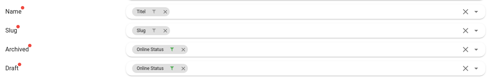
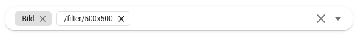
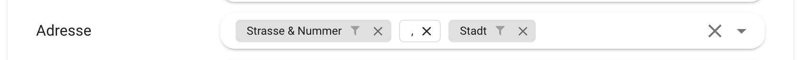

# Webflow Integration

[Webflow](https://www.webflow.com) ist ein ein Dienst für die Erstellung und das Hosting von Webseiten. Der visuelle Editor ermöglicht es Benutzern ohne Programmierkenntnisse ansprechende Webseiten zu gestalten. Verbinde Webflow mit Flyo, um Inhalte automatisiert mit Webflow Collections zu synchronisieren und auf deiner Webseite einzubinden.

## Archiviert / Published 

Webflow benötigt für die Synchronisation die `Archived` und `Draft` Felder. Diese können aus einer Entität bezogen werden oder mittls eines festen Wert `false` standardmässig übergeben werden. Ansonsten ist es auch möglich, das `Online Status` Feld der Entität auf diesen Eintrag zu mappen und den Filter `Negieren` anzuwenden. Das führt dazu, dass er Online-Status in Webflow dem Online-Status in Flyo entspricht.

## Fehler bei Bildsynchronisation

Wenn die Bilder aus Flyo nicht in die Webflow-Collection synchronisiert werden, liegt das an der Bildgrösse. Bilder in Webflow-Collections dürfen maximal 4 MB gross sein. Das Problem kann auf zwei Arten gelöst werden:
1) Ersetze dein Bild in Flyo durch eine entsprechend stärker komprimierte Variante.
2) Nutze unsere [Bilder Proxy](/infos/images.md) und setze direkt im Mapping-Prozess einen Filter, der dein Bild verkleinert.

## Mapping: Kombination von Feldern und Einfügen von zusätzlichen Elementen

Flyo erlaubt es, dass du mehrere Datenbankfelder aus Flyo in ein und dasselbe Feld deiner Webflow-Collection synchronisierst. Zum Beispiel: du hast in Flyo die Felder "Strasse", "Hausnummer" und "Stadt", du möchtest aber in Webflow bloss ein Feld "Adresse" haben. Dazu kannst du im Mapping-Prozess in Flyo einfach nacheinander mehrere Felder wählen. Um zwischen den Felder z.B. ein Komma und einen Abstand zu platzieren, gib einfach die gewünschten Zeichen ins Feld ein und drücke Enter. Du siehst dann, dass deine eingetippten Zeichen als weiss hinterlegtes Element gespeichert werden.

## Metrik

::: warning Webflow Premium Account
Ein Premium Webflow-Account ist Voraussetzug, damit die `Embed Elemente` verwendet werden können.
:::

Um Statistiken ans [Flyo Metrics System](/infos/metrics.md) zu übermitteln, muss Webflow wie folgt konfiguriert werden:

1. Erstelle in der gewünschten CMS Collection bei Webflow ein neues Feld mit dem Namen `Tracking Pixel Flyo` und type Plain Text.
2. Synchronisiere in Flyo das Feld Element `Metrik Tracking Pixel` in das neue Feld.
3. Füge auf der gewünschten CMS Collection Page über das Hinzufügen Menü ein neues Element `Embed` im Abschnitt “Components” hinzu.
4. Füge im HTML Embed Code Editor den Code `` hinzu. Zwischen die beiden ".." fügst du über "+Add Field" das Feld `Tracking Pixel Flyo` hinzu und klickst auf Save & Close
5. In der Webflow Collection muss ein [Embed Element](https://university.webflow.com/lesson/custom-code-embed) erstellt werden, welches in Flyo mit dem Wert `Metric Tracking Pixel` verbunden wird.

## Formatierung von Visual-Editoren übernehmen.

Um die Formatierung (z.B. eingebettete Bilder, Absätze, Zwischentitel) eines Felds, welches du in Flyo über einen visuellen Editor befüllst (z.B. den Text/Inhalt einer Story), nach Webflow zu übernehmen, synchronisiere das Textfeld aus Flyo in ein Rich-Text Element in Webflow.
