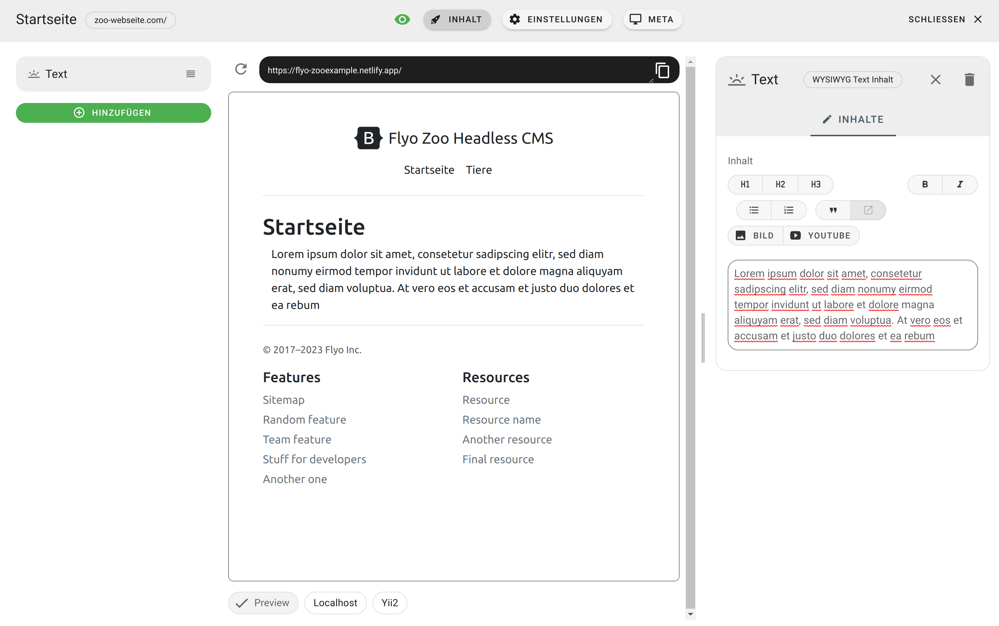
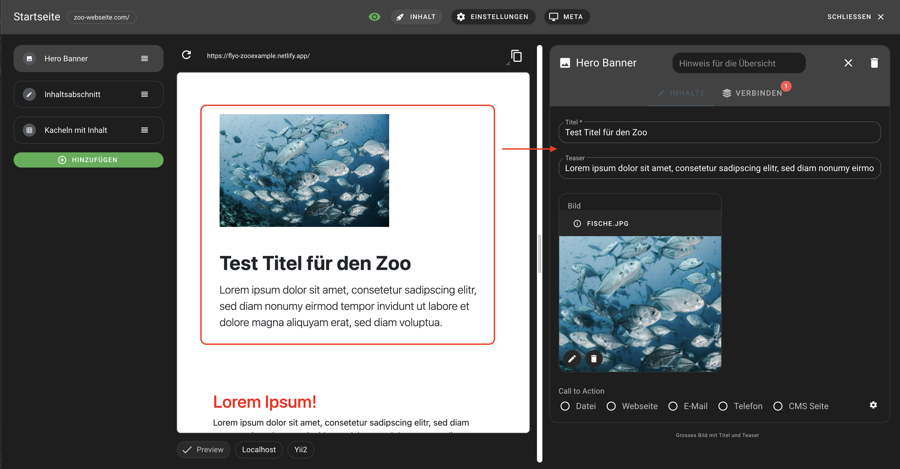

# DEV vs PROD Token

Die Unterscheidung zwischen DEV- und PROD-Token ermöglicht eine bessere Unterscheidung von Entwicklungs- und Produktionsinhalten. DEV-Token werden in der Entwicklungsphase verwendet, um den Zugriff auf temporäre Inhalte zu ermöglichen. PROD-Token hingegen werden in der Produktionsumgebung eingesetzt, um den Zugriff nur auf gespeicherte Inhalte zu gewähren.

## DEV-Token

Wenn eine Eingabe in Flyo erfolgt, steht sie unmittelbar über den DEV-Token zur Verfügung. Das bedeutet, dass man nicht auf "Speichern" klicken muss, um Inhalte direkt über dieses Token von der API abzurufen. Wenn der "Speichern"-Button geklickt wird, werden alle Änderungen des DEV-Token überschrieben. Hintergrundprozesse werden nicht in die DEV-Token-Umgebung übertragen, es sei denn, es wurden Änderungen in der Benutzeroberfläche vorgenommen. Beispielsweise wird ein neuer Eintrag zu einem Content Pool in der DEV-Umgebung nicht direkt sichtbar, es sei denn, man nimmt Änderungen in der Zuordnung dieses Blocks vor oder erneuert alle Änderungen durch Klicken auf den "Speichern"-Button.

## Aktualisierung mit DEV-Token



Wenn in Nitro die Vorschau über ein iFrame eingebunden wird, löst jede Änderung des DEV-Tokens das Ereignis "pageRefresh" aus. Dieses Ereignis kann abgefangen werden, um eine Seitenaktualisierung zu erzwingen und somit auch eine Live-Vorschau für serverbasierte Programmiersprachen einzubauen. Hier ist ein Beispiel in JavaScript:

```js
window.addEventListener("message", (event) => {
    if (event.data?.action === 'pageRefresh') {
        window.location.reload(true);
    }
})
```

## Öffnen in Flyo



Wenn in der Flyo Vorschau auf ein Inhaltselement geklickt wird, kann dieses direkt geöffnet werden in der Bearbeiten Maske, dazu muss ein openEdit-Event ausgeführt werden:

```js
function getActualWindow() {
    if (window === window.top) {
        return window;
    } else if (window.parent) {
        return window.parent;
    }
    return window;
}

function openBlockInFlyo(blockUid) {
    getActualWindow().postMessage({
        action: 'openEdit',
        data: JSON.parse(JSON.stringify({item:{uid: blockUid}}))
    }, 'https://flyo.cloud')
}
```

Danach muss beim Element die Funktion wie folgt aufgerufen werden: `onclick="openBlockInFlyo(uniqueId)"`.
