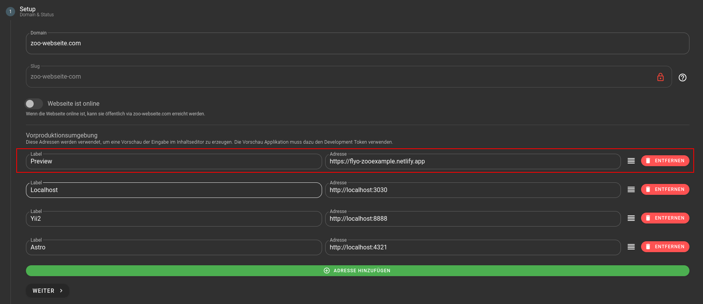

# Environments

## DEV vs PROD Token

Die Unterscheidung zwischen DEV/Entwicklungs- und PROD/Produktiv-Token ermöglicht eine bessere Unterscheidung von Entwicklungs- und Produktionsinhalten. DEV-Token werden in der Entwicklungsphase verwendet, um den Zugriff auf temporäre Inhalte zu ermöglichen. PROD-Token hingegen werden in der Produktionsumgebung eingesetzt, um den Zugriff nur auf gespeicherte Inhalte zu gewähren.

Generell ist zu beachten, dass bei der Entwicklung einer Nitro Headless Seite eine Umgebung sowohl für den produktiven als auch für den Entwicklungs-Token benötigt wird. Der Produktiv-Token verfügt über ein starkes Caching und sollte ausschließlich für die Produktiv-Webseiten-Domain verwendet werden. Der Entwicklungs-Token hat kein Caching und daher eine längere Antwortzeit.
Ein Beispiel wäre:

- **ci.flyozoo.com** => **DEV-TOKEN** => Verwendet den Entwicklungs-Token und wird als Vorproduktionsumgebung in Flyo verwendet.
- **flyozoo.com** => **PROD-TOKEN** => Verwendet den Produktiv-Token und dient ausschließlich der Auslieferung der produktiven Webseite.



::: tip
Die Tokens werden normalerweise in sogenannten Umgebungsvariablen `ENVIRONMENT` der Anwendung bereitgestellt.
:::

## DEV-Token / Entwicklungs-Token

Wenn eine Eingabe in Flyo erfolgt, steht sie unmittelbar über den DEV-Token zur Verfügung. Das bedeutet, dass man nicht auf "Speichern" klicken muss, um Inhalte direkt über dieses Token von der API abzurufen. Wenn der "Speichern"-Button geklickt wird, werden alle Änderungen des DEV-Token überschrieben. Hintergrundprozesse werden nicht in die DEV-Token-Umgebung übertragen, es sei denn, es wurden Änderungen in der Benutzeroberfläche vorgenommen. Beispielsweise wird ein neuer Eintrag zu einem Content Pool in der DEV-Umgebung nicht direkt sichtbar, es sei denn, man nimmt Änderungen in der Zuordnung dieses Blocks vor oder erneuert alle Änderungen durch Klicken auf den "Speichern"-Button.

::: warning DEV-Token Caveats
Wenn Daten im Hintergrund aktualisiert werden, zum Beispiel wenn ein kuratierter Content-Pool neu sortiert wird, führt dies einen Job im Hintergrund aus, der alle Integrationen aktualisiert. Dies gilt jedoch nicht für die Inhalte des DEV-Tokens. Der Grund für dieses Verhalten liegt darin, dass ansonsten aktuelle Änderungen im DEV-Token von anderen Flyo-Benutzern überschrieben werden könnten. Um also die neue Sortierung des kuratierten Content-Pools zu sehen, muss über die Nitro-Integration und den Preview-Frame gearbeitet werden. Diese stellt sicher, dass die aktuellsten Daten geladen werden. Durch das Öffnen des Inhalts im Nitro-Preview-Frame wird sofort der aktuellste Stand der Daten in die DEV-Token-Umgebung geladen und angezeigt.
:::

Der DEV-Token wird nicht zu den Credits gerechnet (verzeichnet keine Requests) bis die Webseite auf "Online" geschalten wird, bis dahin ist der Production-Token inaktiv.

## Aktualisierung mit DEV-Token / Entwicklungs-Token


Wenn in Nitro die Vorschau über ein iFrame eingebunden wird, löst jede Änderung des DEV-Tokens das Ereignis "pageRefresh" aus. Dieses Ereignis kann abgefangen werden, um eine Seitenaktualisierung zu erzwingen und somit auch eine Live-Vorschau für serverbasierte Programmiersprachen einzubauen. Hier ist ein Beispiel in JavaScript:

```js
window.addEventListener("message", (event) => {
    if (event.data?.action === 'pageRefresh') {
        window.location.reload(true);
    }
})
```

::: tip
Diese Funktion sollte nur in der Entwicklungsumgebung verfügbar sein und aus der produktiven Domäne entfernt werden. Deine Applikation muss daher einen Mechanismus haben, um diese Funktion in der Produktionsumgebung zu entfernen.
:::

## Öffnen in Flyo


Wenn in der Flyo Vorschau auf ein Inhaltselement geklickt wird, kann dieses direkt geöffnet werden in der Bearbeiten Maske, dazu muss ein openEdit-Event ausgeführt werden:

```js
function getActualWindow() {
    if (window === window.top) {
        return window;
    } else if (window.parent) {
        return window.parent;
    }
    return window;
}

function openBlockInFlyo(blockUid) {
    getActualWindow().postMessage({
        action: 'openEdit',
        data: JSON.parse(JSON.stringify({item:{uid: blockUid}}))
    }, 'https://flyo.cloud')
}
```

Danach muss beim Element die Funktion wie folgt aufgerufen werden: `onclick="openBlockInFlyo(uniqueId)"`.

::: tip
Diese Funktion sollte nur in der Entwicklungsumgebung verfügbar sein und aus der produktiven Domäne entfernt werden. Deine Applikation muss daher einen Mechanismus haben, um diese Funktion in der Produktionsumgebung zu entfernen.
:::
