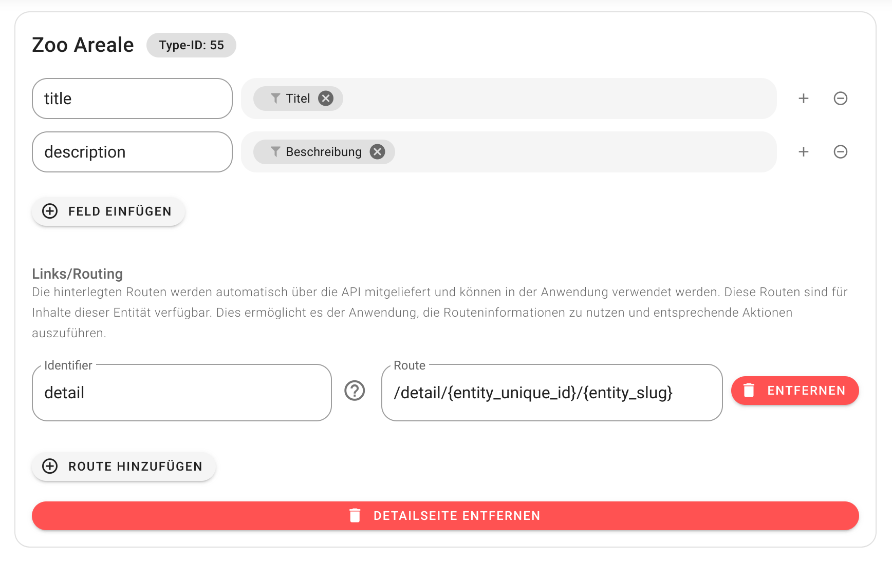

# Entity Detail

Beim Umgang mit Routings ist es wichtig zu wissen, wann eine Entität erforderlich ist und wann nicht. Eine Entität wird normalerweise benötigt, wenn auf eine bestimmte Ressource zugegriffen werden muss, z. B. ein Blog, ein Event, ein Team, ein POI usw. Die Webseite, die Nitro integriert, muss sich daher um die "Detailansicht" dieser Einträge kümmern. In Frameworks wird dies in der Regel als Routing bezeichnet, da eine "URL-Regel" erstellt werden muss. Zum Beispiel `blogs/<slug>` oder `veranstaltung/<uniqueid>`.

Anhand des Slugs oder der Unique-ID werden dann alle Informationen abgerufen, die im Entitäten-Mapping zur Verfügung gestellt wurden, und in die Webseite integriert. Hierfür gibt es verschiedene Endpunkte, um diese Informationen abzurufen. Weitere Informationen findest du in der [API-Dokumentation](https://nitro-openapi.flyo.cloud/#tag/Entities):

- Entität abrufen über [Unique-ID](https://nitro-openapi.flyo.cloud/#tag/Entities/operation/entityByUniqueid)
- Entität abrufen über [Slug](https://nitro-openapi.flyo.cloud/#tag/Entities/operation/entityBySlug) (optional, aber empfohlen: mit Angabe der Type-ID)



## Routing

Um Links zu diesen Entitäten zu vereinfachen, wird automatisch in allen Abschnitten des `Mapping Content Pool` ein Feld namens `link` ausgegeben, das den Slug und die Unique-ID enthält. Falls Routings definiert wurden, werden diese ebenfalls direkt aufgelöst und mitgeliefert. Ein Beispiel für den API-Output sieht wie folgt aus:

```json
[
    {
        "title": "Die Savanne",
        "link": {
            "entity_unique_id": "DOUmbwlt",
            "entity_slug": "savanne",
            "entity_type_id": 55,
            "routes": {
                "detail": "/detail/DOUmbwlt/savanne"
            }
        }
    },
    {
        "title": "Die Eiswüste",
        "link": {
            "entity_unique_id": "RceTkIJZ",
            "entity_slug": "arktis",
            "entity_type_id": 55,
            "routes": {
                "detail": "/detail/RceTkIJZ/arktis"
            }
        }
    }
]
```