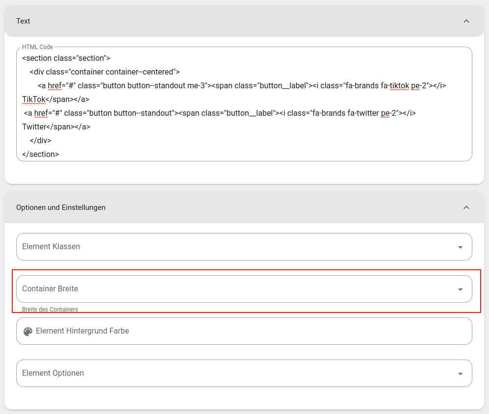

# Webseite Baukasten Integration

:::danger Im Aufbau
Diese Sektion ist zur Zeit noch im Aufbau.
:::

+ Bootstrap 5 Form Styles sind eingebunden https://getbootstrap.com/docs/5.0/forms/overview/
+ Bootstrap 5 Spacing Styles sind eingebunden https://getbootstrap.com/docs/5.0/utilities/spacing/
+ Fontawesome icon free icon set ist eingebunden: https://fontawesome.com/search?m=free&o=r

## Formular

1. HTML Block
2. https://getform.io/

HTML Beispiel:

```html
<form>
    <div class="mb-3">
        <label for="input-name" class="form-label">Dein Name*</label>
        <input type="text" class="form-control" name="name" id="input-name" required>
        <div class="form-text">Wie heisst du mit Vor- und Nachname?</div>
    </div>
    <div class="mb-3">
        <label for="input-email" class="form-label">E-Mail-Adresse*</label>
        <input type="email" class="form-control" name="email" id="input-email" required>
        <div class="form-text">Unter welcher Adresse können wir dich kontaktieren?</div>
    </div>
    <div>
        <button type="submit" class="button button--standout button--primary">
            <span class="button__label">Anfrage absenden</span>
        </button>
    </div>
</form>
```


## Buttons/Links

Link im Inhalt:

```html
<div>
    <a href="#" class="button button--standout">
        <span class="button__label"><i class="fa-regular fa-arrow-right pr-3"></i> BTN WEITER</span>
    </a>
</div>
```

Container mit zentrierten Buttons

::: tip
Wenn eine eigene Section defintion verwendet wird als HTML Code, muss die Container Breite leer sein, ansonsten fügt Nitro das section element autoamtisch ein und du hättest somit 2 sections. Container Breite muss also leer sein:


:::

```html
<section class="section">
    <div class="container container--centered">
        <a href="#" class="button button--standout me-3">
            <span class="button__label"><i class="fa-brands fa-tiktok pe-2"></i> TikTok</span>
        </a>
        <a href="#" class="button button--standout">
            <span class="button__label"><i class="fa-brands fa-twitter pe-2"></i> Twitter</span>
        </a>
    </div>
</section>
```
